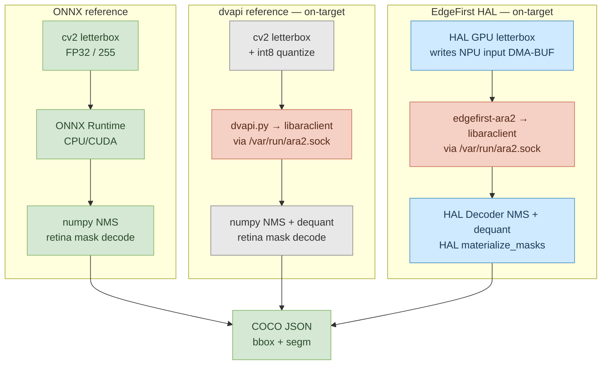

# Ara240 Validator

> **YOLOv8-seg COCO validation on the NXP Ara240 NPU, end-to-end.** Three reference inference paths (FP32 ONNX host, dvapi+numpy on-target, EdgeFirst HAL on-target) producing pycocotools-evaluated COCO JSON, with per-stage timings on each.

| | What it shows | Where it runs |
|---|---|---|
| **`onnx_reference`** | FP32 ONNX accuracy ceiling | any CPU/CUDA host, or on-target |
| **`reference`** | int8 NPU baseline using NXP dvapi.py | imx8mp-frdm, imx95-frdm |
| **`edgefirst`** | int8 NPU + GPU letterbox + HAL Decoder | imx8mp-frdm, imx95-frdm |

This validator augments the NXP-supplied dvapi reference with EdgeFirst HAL acceleration: GPU letterbox preprocessing rendered directly into the NPU input buffer, NMS and mask materialisation in compiled Rust, all sharing the dvproxy DMA-BUF surface for zero-copy data movement. It is an **offline benchmarking + validation tool**, not a production streaming application — each pipeline stage runs serially so per-stage cost is captured cleanly. For live camera/video inference with EdgeFirst, see the [ara2-rs examples](https://github.com/EdgeFirstAI/ara2-rs/tree/main/examples).

## Scope of this demonstration

This repository validates **a single model (YOLOv8n-seg) on a single NPU (NXP Ara240) for a single task (COCO instance segmentation)**.

For multi-model, multi-sensor, multi-platform productisation — data labelling, training, deployment, and OTA at fleet scale — see **[EdgeFirst Studio](https://edgefirst.studio/)**. Studio ships these workflows end-to-end and supports target hardware beyond Ara240 (i.MX 8M Plus, i.MX 95, Raspberry Pi + Hailo, NVIDIA Jetson) with first-class support for radar, lidar, and camera fusion.

## Results

### coco-val5k (5000 images, imx8mp-frdm)

The full COCO val2017 set. Drift columns are absolute **percentage points** (`mAP_a − mAP_b`).

| Run | Box mAP | Box mAP@50 | Mask mAP | Mask mAP@50 | Mask mAR@100 |
|---|---:|---:|---:|---:|---:|
| `onnx_reference` retina (FP32, host CPU) | **0.3605** | 0.5119 | **0.2801** | 0.4716 | 0.4115 |
| `edgefirst` retina (HAL int8) | 0.3068 | 0.4745 | 0.2756 | 0.4549 | 0.4170 |
| **drift (pp)** | **−5.37** | −3.74 | **−0.45** | −1.67 | +0.55 |

> [!NOTE]
> The dvapi.py reference is excluded from the val5k row because the underlying `libaraclient_aarch64.so` ctypes wrapper hits a glibc `double free or corruption` abort after roughly 100–200 sequential inferences in a single process. coco128 (128 images) generally completes; coco-val5k (5000) does not. The Rust-backed `edgefirst-ara2` wrapper used by `edgefirst.py` is unaffected and is the route used for the val5k row.

### coco128 — per-stage timing (128 images)

All scripts run on-target so the per-stage timings are directly comparable. Top block is imx8mp-frdm; bottom block is imx95-frdm.

| Script | Mask | Box mAP | Mask mAP | Pre | Inf | Post (nms+mask) | End-to-end |
|---|---|---:|---:|---:|---:|---:|---:|
| **imx8mp-frdm** | | | | | | | |
| `onnx_reference` (FP32, on-target CPU) | retina | **0.4533** | **0.3444** | 1.7 ms | 46.3 ms | 47.6 ms | 95.7 ms |
| `onnx_reference` (FP32, on-target CPU) | fast | 0.4533 | 0.3337 | 1.8 ms | 44.6 ms | 47.8 ms | 94.1 ms |
| `reference` (dvapi+numpy) | retina | 0.3941 | 0.3278 | 21.1 ms | 18.0 ms | 412.9 ms | 452.2 ms |
| `reference` (dvapi+numpy) | fast | 0.3941 | 0.3221 | 20.6 ms | 18.2 ms | 293.4 ms | 332.3 ms |
| `edgefirst` (HAL) | retina | 0.3970 | 0.3220 | 6.2 ms | 13.7 ms | 44.3 ms | **64.2 ms** |
| `edgefirst` (HAL) | fast | 0.3970 | 0.3142 | 6.2 ms | 13.7 ms | 24.0 ms | **43.9 ms** |
| **imx95-frdm** | | | | | | | |
| `edgefirst` (HAL) | retina | 0.3981 | 0.3233 | 4.2 ms | 12.0 ms | 39.3 ms | **55.6 ms** |
| `edgefirst` (HAL) | fast | 0.3981 | 0.3152 | 4.1 ms | 12.0 ms | 24.2 ms | **40.2 ms** |

`Post` = NMS decode + mask materialisation. `End-to-end` = preprocess + inference + postprocess. RLE-encoding the binary masks is reported separately as output formatting (only relevant to validation, not deployment). The dvapi+numpy reference is omitted from the imx95 block because the dvproxy / `libaraclient` stack on that board needs intermittent restarts before each long run; the HAL path via `edgefirst-ara2` is unaffected.

#### NPU inference breakdown

The `Inf` column above is the wall-clock time `model.run()` takes — input-in, NPU compute, output-out, plus whatever host-side staging the backend requires. The NPU driver also reports per-stage sub-timings the firmware actually spent on the device. Since the NPU runs the same model the same way for both backends, the firmware sub-timings are essentially identical; the difference between the two `Inf` numbers is host-side staging cost, which is what the DMA-BUF zero-copy path eliminates.

| | DMA host→device | NPU compute | DMA device→host | Driver subtotal | Wall-clock roundtrip | Host overhead |
|---|---:|---:|---:|---:|---:|---:|
| `reference` (dvapi) on imx8mp | 2.17 ms | 4.40 ms | 4.66 ms | 11.23 ms | **17.94 ms** | 6.71 ms |
| `edgefirst` (ara2-rs) on imx8mp | 2.23 ms | 4.40 ms | 4.93 ms | 11.56 ms | **13.67 ms** | 2.11 ms |
| `edgefirst` (ara2-rs) on imx95 | 1.98 ms | 4.40 ms | 3.15 ms | 9.53 ms | **12.00 ms** | 2.47 ms |

The ~4.6 ms host-overhead delta between dvapi and edgefirst on imx8mp is the DMA-BUF benefit. The dvapi path moves the input tensor through a host buffer (numpy → libaraclient ctypes → dvproxy) and the output tensor back the same way; the edgefirst path uses `Tensor.from_fd` to wrap the dvproxy DMA-BUF directly, so the GPU letterbox writes the input DMA-BUF in place and HAL's Decoder reads the output DMA-BUF in place — the host never touches either buffer. The `HalPipeline` class is what wires this up; see its docstring for the construct-once / reuse-many invariants HAL Optimization Guide Rules 1, 4, and 5 require to keep the path zero-copy.

> [!IMPORTANT]
> These numbers use a validation NMS score threshold of `0.001` (the Ultralytics `val` default), which keeps a long tail of low-confidence detections to produce a complete precision-recall curve. A real deployment uses a higher threshold (typically `0.50`), reducing the surviving detection count and therefore the postprocess time. See [Deployment-style timing](#deployment-style-timing) for an example.

### What "end-to-end" measures

`End-to-end` covers the per-frame work after image acquisition:

1. **preprocess** — letterbox resize, normalise, quantise, lay out as the NPU's input tensor.
2. **inference** — submit input, run NPU, retrieve output.
3. **postprocess** — NMS over the dequantised detection grid, then materialise per-detection binary masks at original image resolution.

Stages excluded from end-to-end because they are validation-only or environment-specific:

- **image decode** — JPEG → RGB buffer. In a real pipeline the frame arrives from a camera or video decoder, not from disk.
- **output formatting** — pycocotools RLE encoding for the COCO results JSON. A deployment would consume the binary masks directly.
- **COCO evaluation** — pycocotools per-image mAP computation. Strictly an offline validation step.

### Deployment-style timing

The numbers above measure *validation* mask cost: the validator calls HAL's `materialize_masks` and then RLE-encodes each per-detection mask for pycocotools. A live deployment doesn't do that — it composites masks straight onto a display canvas via HAL's fused `ImageProcessor.draw_masks`, which decodes, materialises, and blends in one Rust/GPU call without ever round-tripping per-detection masks through Python.

`tests/bench_draw_masks.py` runs the same 128-image set through that fused path at `--score-threshold 0.5`:

| Stage | imx8mp-frdm | imx95-frdm |
|---|---:|---:|
| preprocess (GPU) | 5.91 ms | 3.96 ms |
| inference (wall) | 13.48 ms | 11.98 ms |
| draw_masks (decode + materialize + render) | 21.97 ms | 21.55 ms |
| **end-to-end (pre + inf + draw)** | **41.36 ms** | **37.50 ms** |

For the canonical live-pipeline pattern (camera → NPU → fused draw_masks → Wayland compositor) see [`ara2-rs/examples/yolov8_live.py`](https://github.com/EdgeFirstAI/ara2-rs/blob/main/examples/yolov8_live.py); for the API surface see HAL's `ImageProcessor.draw_masks` and `ImageProcessor.draw_decoded_masks`. The *EdgeFirst for i.MX Reference Manual* documents the full `edgefirstoverlay` per-stage timing methodology that this script mirrors.

End-to-end throughput in any threshold setting can be increased further by overlapping the preprocess of frame *N+1* with the inference of frame *N* (an async pipeline). That work is out of scope for this validator, which focuses on documenting per-stage latency and accuracy under a serial, deterministic execution model.

## Installation

The validator and its HAL extra install in one step from this repository.

### On-target (imx8mp-frdm or imx95-frdm)

```bash
ssh imx8mp-frdm
python3 -m venv /root/venv
source /root/venv/bin/activate
pip install --upgrade pip
pip install 'ara2-validator[hal] @ git+https://github.com/EdgeFirstAI/ara2-validator.git'
```

The `[hal]` extra pulls [`edgefirst-hal>=0.18.1`](https://github.com/EdgeFirstAI/hal) and `edgefirst-ara2`. The `>=0.18.1` floor is required: earlier versions ship either a scalar `materialize_masks` (0.17.x, ~569 ms / image at N=119 detections) or a single-threaded variant (0.18.0, regressed by PR #51). 0.18.1 restores the rayon-parallel + per-detection logit-precompute path for ~33 ms / image.

### Host (FP32 ONNX baseline)

```bash
python3 -m venv venv
source venv/bin/activate
pip install --upgrade pip
pip install 'ara2-validator[onnx] @ git+https://github.com/EdgeFirstAI/ara2-validator.git'
```

### Dataset

`coco128-seg` (128 train2017 images plus filtered COCO segmentation annotations) is hosted at:

```bash
wget https://repo.edgefirst.ai/datasets/coco128-seg.zip
unzip coco128-seg.zip -d /root/
```

For coco-val5k:

```bash
wget http://images.cocodataset.org/zips/val2017.zip
wget http://images.cocodataset.org/annotations/annotations_trainval2017.zip
unzip val2017.zip -d /root/
unzip annotations_trainval2017.zip -d /root/
```

## Quick start

```bash
python -m ara2_validator.edgefirst \
    --model yolov8n-seg-kinara-1.2.1.dvm \
    --images /root/coco128-seg/images/ \
    --gt /root/coco128-seg/annotations/instances_train2017.json \
    --with-masks
```

This completes in about 40 s on imx8mp-frdm (warmup + 128 inferences + COCO evaluation). Add `--fast-masks` for the latency-tuned mask path.

## Architecture



The `edgefirst` path differs from the `reference` path in three places:

- **Preprocess** runs on the GPU and writes its result directly into the DMA-BUF surface that dvproxy will hand to the NPU as its input tensor — no host-side copy between letterbox output and NPU input.
- **NMS + dequantisation** runs in compiled Rust against the dvproxy output DMA-BUF surface, so the HAL Decoder reads the NPU output without staging through host memory.
- **Mask materialisation** runs in HAL's batched-GEMM kernel (rayon-parallel) instead of a per-detection numpy `cv2.resize`.

### Capability matrix

| | `onnx_reference` | `reference` | `edgefirst` |
|---|---|---|---|
| Device | PC / any CPU, or on-target | imx8mp-frdm, imx95-frdm | imx8mp-frdm, imx95-frdm |
| Runtime | ONNX Runtime | dvapi → libaraclient | edgefirst-ara2 → libaraclient |
| Preprocess | cv2 (CPU) | cv2 + int8 quant (CPU) | HAL GPU (DMA-BUF) |
| NMS | numpy (CPU) | numpy + dequant (CPU) | HAL Decoder (Rust) |
| Mask decode | numpy retina or process_mask | numpy retina or process_mask | HAL `materialize_masks` (Scaled or Proto) |
| Box eval | ✅ bbox | ✅ bbox | ✅ bbox |
| Mask eval | ✅ segm | ✅ segm | ✅ segm |
| NPU sub-timings | — | ✅ DMA + NPU | ✅ DMA + NPU |

### Model format

The ONNX reference uses the standard Ultralytics export with a single concatenated output `[1, 116, 8400]` (4 box + 80 class + 32 mask coeff) plus prototype tensor `[1, 32, 160, 160]`.

The Ara240 DVM (`yolov8n-seg-kinara-1.2.1.dvm`) uses a **split-decoder** output format compiled by the NXP toolchain:

| Tensor | Shape | Dtype | Description |
|--------|-------|-------|-------------|
| `protos` | [1, 32, 160, 160] | int8 | Mask prototype spatial basis |
| `mask_coefs` | [1, 32, 8400] | int8 | Mask prototype weights |
| `scores` | [1, 80, 8400] | uint8 | Per-class confidence |
| `boxes` | [1, 4, 8400] | int16 | Box coordinates (xcycwh) |

Other DVMs (e.g. from EdgeFirst Studio sessions) may split boxes into separate xy `[1, 2, 8400]` and wh `[1, 2, 8400]` tensors with independent quantisation parameters. Both formats are handled automatically.

## Mask materialisation modes

Each script defaults to the **retina** mask path — Ultralytics `ops.process_mask_native()`: bilinear-upsample the continuous f32 logit plane to original-image resolution, then threshold at `logit > 0`. This is the right mode for COCO evaluation and for visualisation, and is what `MaskResolution.Scaled(orig_w, orig_h)` selects in the HAL backend.

The `--fast-masks` flag is an opt-in to a lower-latency path:

- **`edgefirst`** — `MaskResolution.Proto` returns continuous-sigmoid u8 tiles at proto resolution and the caller upsamples each tile via `cv2.resize`. About 1.5× faster end-to-end on imx8mp-frdm, ~0.8 pp lower mask mAP.
- **`reference` and `onnx_reference`** — Ultralytics `ops.process_mask()`: threshold logits at proto resolution, bilinear-upsample the binary mask, re-threshold. Same speed as retina on these stacks (per-detection upsample dominates either way), ~0.6 pp lower mask mAP.

## Usage

### `onnx_reference` — FP32 ONNX (host or on-target)

```bash
python -m ara2_validator.onnx_reference \
    --model yolov8n-seg.onnx \
    --images /root/coco128-seg/images/ \
    --gt /root/coco128-seg/annotations/instances_train2017.json \
    --with-masks \
    --provider cpu
```

### `reference` — Ara240 dvapi (imx8mp-frdm, imx95-frdm)

```bash
python -m ara2_validator.reference \
    --model yolov8n-seg-kinara-1.2.1.dvm \
    --images /root/coco128-seg/images/ \
    --gt /root/coco128-seg/annotations/instances_train2017.json \
    --with-masks
```

### `edgefirst` — EdgeFirst HAL (imx8mp-frdm, imx95-frdm)

```bash
python -m ara2_validator.edgefirst \
    --model yolov8n-seg-kinara-1.2.1.dvm \
    --images /root/coco128-seg/images/ \
    --gt /root/coco128-seg/annotations/instances_train2017.json \
    --with-masks
```

### Common CLI options

| Flag | Default | Description |
|------|---------|-------------|
| `--model` | (required) | Model file (.onnx or .dvm) |
| `--images` | (required) | Image directory |
| `--output` | per-script | COCO results JSON output path |
| `--score-threshold` | 0.001 | NMS score threshold (Ultralytics `val` default) |
| `--iou-threshold` | 0.7 | NMS IoU threshold (Ultralytics `val` default) |
| `--max-detections` | 300 | Max detections per image (Ultralytics `max_det`) |
| `--max-images` | all | Limit number of images processed |
| `--warmup` | 3 | Warmup iterations (excluded from timing) |
| `--gt` | none | COCO GT JSON for evaluation |
| `--log-level` | INFO | One of DEBUG, INFO, WARNING, ERROR |

### Script-specific options

| Flag | Script | Description |
|------|--------|-------------|
| `--with-masks` | all | Enable segmentation mask decode + eval |
| `--fast-masks` | all | Use the lower-accuracy / lower-latency mask decode path |
| `--provider cpu\|cuda` | `onnx_reference` | ONNX Runtime execution provider |
| `--labels` | `reference`, `edgefirst`, `__main__` | Path to labels.txt |
| `--socket` | `reference`, `edgefirst`, `__main__` | dvproxy socket (default: `/var/run/ara2.sock`) |
| `--backend numpy\|hal` | `__main__` | Backend selector for the side-by-side A/B harness |

`python -m ara2_validator` is a side-by-side A/B harness that wraps both backends behind one entry point; `edgefirst.py` is the canonical HAL entry point.

## Benchmark methodology

**Image decode is reported separately from end-to-end.** The decode stage (JPEG → RGB buffer) simulates loading from disk and is not representative of a live pipeline where frames arrive from a camera or video decoder. The end-to-end timing (preprocess + inference + postprocess) represents the per-frame cost after image acquisition.

**Postprocess includes the mask decode.** For both validators "postprocess" is `nms_decode + mask_decode` (or `nms_decode + materialize_hal` on the HAL path). RLE-encoding the binary masks for the COCO output JSON is reported separately as **output formatting** because it is identical work in every script and is not part of the inference pipeline.

**Validation threshold inflates postprocess.** `--score-threshold 0.001` matches Ultralytics `val` defaults and produces a complete precision-recall curve; a deployment would use `~0.50` and see substantially fewer surviving detections per frame. See [Deployment-style timing](#deployment-style-timing).

**Serial pipeline.** Each stage runs serially to capture accurate per-stage timing. An optimised deployment can overlap preprocessing of frame *N+1* with inference of frame *N*, increasing throughput (gated by the slowest stage) without reducing per-frame latency. The validator does not implement this.

**Outlier filter.** All timing values are reported as min/mean/max after filtering the top and bottom 1% outliers (one sample on each side of a 128-image run). On-target benchmarks see occasional spikes from cgroup CPU pressure, dvproxy stalls, and GPU driver warmup — trimming suppresses those without losing the mean.

**Sequential, never parallel.** Benchmarks against the same target are run sequentially; running two validator processes in parallel on the same host invalidates the per-stage timings via shared GPU/CPU contention.

## Known limitations

### dvapi.py heap corruption past ~100 inferences/process

The `dvapi.py` ctypes wrapper around `libaraclient_aarch64.so` hits a glibc `double free or corruption` abort after roughly 100–200 sequential inferences in a single process. coco128 (128 images) generally completes; coco-val5k (5000 images) does not. The Rust-backed `edgefirst-ara2` wrapper used by `edgefirst.py` is unaffected and is the recommended route for full val5k runs.

### Mask edges are not bit-identical to Ultralytics

int8 quantisation produces protos that are near-identical but not bit-identical to the FP32 reference, so per-mask IoU is in the 0.95–0.99 range rather than 1.0. This is reflected in the −0.45 pp mask mAP drift figure on val5k.

## Dependencies

### All scripts

- `numpy`, `opencv-python`, `Pillow` — preprocessing and image I/O
- `pycocotools` — COCO evaluation and RLE mask encoding

### `onnx_reference`

- `onnxruntime` — FP32 inference (`pip install onnxruntime`)

### `reference`

- `libaraclient.so` — NXP Ara240 client library (part of the Ara240 runtime SDK)
- `dvapi.py` — ctypes wrapper (vendored in this repo, patched for imx8mp)
- `dvproxy` daemon running with `/var/run/ara2.sock` present

### `edgefirst`

- `edgefirst-hal>=0.18.1` — GPU-accelerated preprocessing and postprocessing (the floor is required: 0.17.x ships a scalar `materialize_masks` ~17× slower; 0.18.0 dropped the rayon parallelism the kernel needs and 0.18.1 restored it)
- `edgefirst-ara2` — Rust/pyo3 wrapper around libaraclient with DMA-BUF tensor mapping
- Same `dvproxy` + `libaraclient.so` requirements as `reference`

## Project structure

```
ara2_validator/
├── __main__.py          # Side-by-side A/B harness (--backend numpy|hal)
├── onnx_reference.py    # FP32 ONNX reference
├── reference.py         # Ara240 dvapi + numpy/OpenCV
├── edgefirst.py         # EdgeFirst HAL — canonical HAL entry point
├── hal_pipeline.py      # HalPipeline class — copy-paste-ready HAL setup
├── postprocess_hal.py   # MaskMode enum + materialize_masks_for_coco_*
├── postprocess_numpy.py # NumPy decode: dequant → boxes → NMS → masks
├── preprocess.py        # Letterbox resize, quantise, HalPreprocessor
├── nms.py               # Pure numpy NMS (class-aware, Ultralytics algorithm)
├── coco_output.py       # COCO JSON serialisation with RLE masks
├── coco_eval.py         # pycocotools evaluation wrapper
├── _stats.py            # Shared trimmed-mean + per-stage formatter
├── model.py             # Ara240 model loading and metadata
├── dvapi.py             # Vendored NXP Ara240 SDK ctypes wrapper
└── tests/
    ├── test_hal_path.py     # Regression guards for the HAL contract
    └── bench_draw_masks.py  # Deployment-style fused draw_masks bench
```

## See also

- **[EdgeFirst Studio](https://edgefirst.studio/)** — multi-model, multi-sensor, multi-platform productisation platform (this repository is a single-model demonstration).
- **[EdgeFirst HAL](https://github.com/EdgeFirstAI/hal)** — hardware abstraction layer (Rust + Python bindings); see the Optimization Guide in the HAL README for the rules `HalPipeline` encodes.
- **[ara2-rs examples](https://github.com/EdgeFirstAI/ara2-rs/tree/main/examples)** — live camera/video inference using `edgefirst-ara2`. In particular `yolov8_live.py` is the canonical pattern for the camera → NPU → fused `draw_masks` → Wayland compositor pipeline that `tests/bench_draw_masks.py` mirrors. This validator is the offline / batched counterpart.
- **EdgeFirst for i.MX Reference Manual** — documents the `edgefirstoverlay` instrumented per-stage timing methodology and platform-by-platform mask-rendering benchmarks that complement the on-device numbers reported here.
