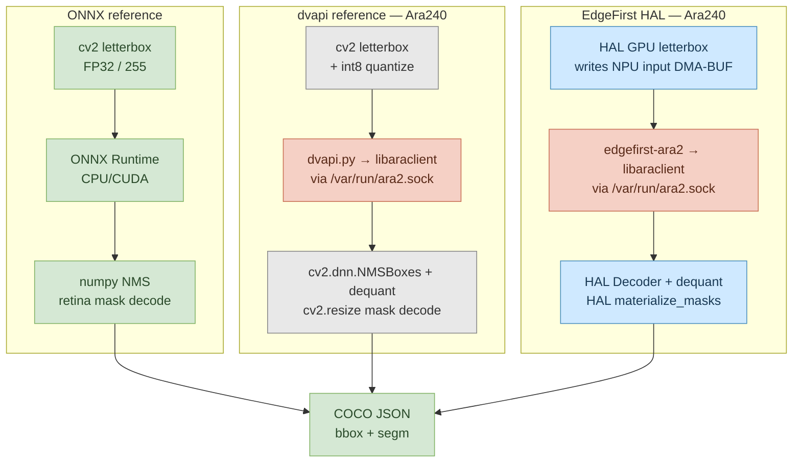

# HAL Validator (`ara2-validator`)

A rudimentary harness for Ultralytics YOLO segmentation validation. It compares **NPU reference pipelines** (vendor- or upstream-faithful, no EdgeFirst components) against **EdgeFirst HAL pipelines** on the same NPU model file, with both anchored against the **reference model** — the Ultralytics FP32 ONNX export — so accuracy drift and per-stage timing cost are readable off the same table.

The repo started as `ara2-validator` (NXP Ara240 only) and now covers Ara240 and Hailo-8/8L on Raspberry Pi 5, with more targets planned. Each new target adds rows to the tables below and a subsection in [Reproduction](#reproduction) — no new per-platform sections in the body.

## Three concepts: reference model, reference pipeline, EdgeFirst pipeline

The terminology is consistent across all EdgeFirst documentation, and matters here because each table compares all three:

- **Reference model** — Ultralytics ONNX FP32 export, treated as effectively lossless from the original PyTorch checkpoint. This is the accuracy ceiling, run once on a host CPU; its absolute mAP is the baseline that every NPU number is reported relative to. Per-stage timing is not reported (host CPU latency is not the question this validator is asking).
- **Reference pipeline** — the NPU run via the vendor's documented integration: NPU + vendor SDK (e.g. TAPPAS C++ for Hailo, dvapi for Ara240) + OpenCV/NumPy for whatever the SDK doesn't cover (preprocess everywhere; postprocess on Ara240, where the SDK ships no postprocess library). This is what a user lands on following the SDK docs verbatim.
- **EdgeFirst pipeline** — the *same NPU model* run through `edgefirst-hal` for preprocessing, detection decode, NMS, and mask materialisation. Same NPU bytes, same compiled graph, same int8 quantisation — only the host-side software around the NPU changes.

The "drift vs reference model" column in each table is what the int8 quantisation **plus** the chosen pipeline cost in mAP versus the FP32 ceiling. Comparing the reference-pipeline drift with the edgefirst-pipeline drift on the same NPU is the within-target apples-to-apples accuracy answer.

### Backend dispatch

| Backend | Concept | Description | Platforms |
|---|---|---|---|
| `onnx_reference` | reference model | Ultralytics FP32 ONNX export, host CPU/CUDA — accuracy ceiling | any host |
| `reference` (`--backend numpy`) | reference pipeline | NXP `dvapi.py` ctypes + OpenCV/NumPy postprocess | imx8mp-frdm, imx95-frdm |
| `hailo` (`--backend hailo`) | reference pipeline | Hailo TAPPAS non-GStreamer C++ postprocess | RPi5 + Hailo-8/8L |
| `edgefirst` (`--backend hal`) | EdgeFirst pipeline | HAL on Ara240 — DMA-BUF zero-copy GPU↔NPU | imx8mp-frdm, imx95-frdm |
| `hal-hailo` (`--backend hal-hailo`) | EdgeFirst pipeline | HAL on Hailo — GPU letterbox + HAL Decoder | RPi5 + Hailo-8/8L |

### Per-platform reference-pipeline notes

**Ara240 (`numpy` backend).** Uses NXP's `dvapi.py` ctypes wrapper around `libaraclient_aarch64.so` for NPU inference, followed by `cv2.dnn.NMSBoxes` for NMS and `cv2.resize` per-detection for mask decode. This is the path documented by NXP as the vendor integration route.

**Hailo (`hailo` backend).** Uses Hailo's official non-GStreamer C++ instance-segmentation example — the same postprocess that TAPPAS GStreamer apps ship as a shared library. It is vendored under `third_party/hailo_tappas_baseline/` at commit [`7b850e0`](https://github.com/hailo-ai/Hailo-Application-Code-Examples/tree/7b850e0444a142ada88443d675e3c3ddda18bd74) of [hailo-ai/Hailo-Application-Code-Examples](https://github.com/hailo-ai/Hailo-Application-Code-Examples) (MIT licence). A small local patch threads runtime score/IoU thresholds through the `filter()` call so pycocotools' `0.001` convention works; the original logic is otherwise untouched. See [`third_party/hailo_tappas_baseline/README.md`](third_party/hailo_tappas_baseline/README.md) for provenance, the patch description, and the upstream commit hash.

**Future platforms** add a bullet here, rows in the tables below, and a subsection in [Reproduction](#reproduction).

### A note on HAL preprocess: GPU vs CPU

HAL's preprocess runs on the platform GPU (V3D on RPi5, Vivante on Ara240 boards) via OpenGL ES, not on the CPU. At a 640×640 model input and an aarch64 Cortex-A76, OpenCV's NEON-accelerated `cv2.resize` on the CPU is fast enough that HAL GPU preprocess does **not** beat it on wall-clock — measured on RPi5, OpenCV is ~0.9 ms vs HAL's ~2.2 ms (the extra 1.3 ms is one host memcpy out of the GPU buffer that a unified-memory NPU like Ara240 doesn't pay). What HAL preprocess gives back is that the CPU isn't doing the work, so the host-side decode + NMS + mask matmul that follow can run on a quiet CPU instead of fighting the resize for cycles. At larger camera resolutions (1080p input → 640×640 model) HAL's GPU preprocess is several times faster than OpenCV CPU even on wall-clock; below 640×640 the trade is GPU-utilisation vs CPU-availability, not raw latency.

The reference-pipeline rows below all use OpenCV CPU preprocess because that is what the vendor SDKs document. EdgeFirst pipelines all use HAL GPU preprocess. A user who wants HAL postprocess with OpenCV preprocess (or any other combination) can wire it up from the building blocks in `ara2_validator/preprocess.py` and `ara2_validator/postprocess_hal.py`; the validator does not enumerate every permutation.

### Output tensor structure: 4 tensors (Ara240) vs 10 tensors (Hailo)

The two NPUs leave different amounts of work for the host, which frames the postprocess timing differences across platforms:

| | Ara240 | Hailo-8/8L |
|---|---|---|
| Output tensor count | **4** | **10** |
| Boxes | 1 tensor `[1, 4, 8400]` — already DFL-decoded + concatenated on chip | 3 tensors `[1, H, W, 64]` per FPN level — raw DFL bins |
| Scores | 1 tensor `[1, 80, 8400]` | 3 tensors per FPN level (sigmoid may be DFC-fused) |
| Mask coefficients | 1 tensor `[1, 32, 8400]` | 3 tensors per FPN level |
| Protos | 1 tensor `[1, 32, 160, 160]` NCHW | 1 tensor `[1, 160, 160, 32]` NHWC |
| Host-side work | Dequant + score filter + NMS + matmul | DFL decode + per-scale dequant + score filter + NMS + matmul |

Ara240 runs box-DFL decode on-chip; Hailo leaves it as host work in exchange for a smaller compiled graph. HAL's per-scale Decoder absorbs the extra DFL work, which is why the `nms_decode` column for `hal-hailo` carries more CPU time than for `hal` on Ara240 — it is doing more. Schema-driven decoding is mandatory on Hailo: the embedded `edgefirst.json` (schema-v2, written by hailo-converter v0.3.0+) tells HAL which of the 10 raw tensors holds which role and which FPN scale.

## Results

### A — coco-val5k (5000 images, `--score-threshold 0.001`)

Full COCO val2017. The reference-model row at the top is the FP32 ceiling; every NPU row reports its absolute mAP and the drift vs that ceiling in percentage points. End-to-end = preprocess + inference + decode + mask materialisation (image decode and RLE encoding excluded).

| Platform | Pipeline | Box mAP (Δ pp) | Box mAP@50 | Mask mAP (Δ pp) | Mask mAP@50 | Mask mAR@100 | End-to-end | FPS |
|---|---|---:|---:|---:|---:|---:|---:|---:|
| host CPU | reference model (ONNX FP32) | **0.3605** | 0.5119 | **0.2801** | 0.4716 | 0.4115 | — | — |
| imx8mp-frdm | reference pipeline (dvapi+opencv) | — see note | — | — | — | — | — | — |
| imx8mp-frdm | EdgeFirst pipeline (HAL) | 0.3068 (−5.37) | 0.4745 | 0.2756 (−0.45) | 0.4549 | 0.4170 | — | — |
| RPi5 + Hailo-8L | reference pipeline (TAPPAS) | 0.2164 (−14.41) | 0.3419 | 0.1704 (−10.97) | 0.3046 | 0.3575 | 1218.32 ms | 0.8 |
| RPi5 + Hailo-8L | EdgeFirst pipeline (HAL) | **0.3306 (−2.99)** | **0.4744** | **0.2768 (−0.33)** | **0.4461** | **0.3794** | **29.65 ms** | **33.7** |

> [!NOTE]
> **Ara240 reference pipeline on val5k is N/A** because `libaraclient_aarch64.so` hits a glibc `double free or corruption` abort after ~100–200 sequential inferences; coco128 (128 images) generally completes, val5k (5000) does not. The EdgeFirst pipeline goes through the Rust-backed `edgefirst-ara2` wrapper and is unaffected.

> [!IMPORTANT]
> On Hailo, the EdgeFirst pipeline lands within **~3 pp Box** and **~0.3 pp Mask** of the FP32 reference model and runs at **~33.7 FPS**. The TAPPAS reference pipeline drifts ~14 pp Box and ~11 pp Mask from the same ceiling and runs at 0.8 FPS — the int8 quantisation costs almost nothing, the host-side pipeline choice costs ten percentage points and 41× throughput.

### B — coco128 @ validation threshold (`--score-threshold 0.001`)

128 images, score threshold 0.001 (Ultralytics `val` default — required for full P-R curve mAP). All runs synchronous, one frame at a time.

| Platform | Pipeline | Mask mode | Box mAP (Δ pp) | Mask mAP (Δ pp) | Pre | Inf | Decode | Mask | End-to-end |
|---|---|---|---:|---:|---:|---:|---:|---:|---:|
| host CPU | reference model (ONNX FP32) | retina | **0.4533** | **0.3444** | — | — | — | — | — |
| host CPU | reference model (ONNX FP32) | fast | 0.4533 | 0.3337 | — | — | — | — | — |
| imx8mp-frdm | reference pipeline (dvapi+opencv) | retina | 0.3941 (−5.92) | 0.3278 (−1.66) | 24 ms | 18 ms | 32 ms | 265 ms | 339 ms |
| imx8mp-frdm | reference pipeline (dvapi+opencv) | fast | 0.3941 (−5.92) | 0.3221 (−1.16) | 21 ms | 18 ms | 33 ms | 179 ms | 251 ms |
| imx8mp-frdm | EdgeFirst pipeline (HAL) | retina | 0.3955 (−5.78) | 0.3218 (−2.26) | 6.2 ms | 13.5 ms | 2.6 ms | 9.7 ms | **32.0 ms** |
| imx8mp-frdm | EdgeFirst pipeline (HAL) | fast | 0.3955 (−5.78) | 0.3095 (−2.42) | 6.2 ms | 13.5 ms | 2.6 ms | 3.8 ms | **26.1 ms** |
| imx95-frdm | reference pipeline (dvapi+opencv) | retina | 0.3941 (−5.92) | 0.3278 (−1.66) | 20 ms | 16 ms | 32 ms | 172 ms | 240 ms |
| imx95-frdm | reference pipeline (dvapi+opencv) | fast | 0.3941 (−5.92) | 0.3221 (−1.16) | 17 ms | 16 ms | 31 ms | 193 ms | 257 ms |
| imx95-frdm | EdgeFirst pipeline (HAL) | retina | 0.3966 (−5.67) | 0.3231 (−2.13) | 4.1 ms | 11.3 ms | 2.6 ms | 7.6 ms | **25.5 ms** |
| imx95-frdm | EdgeFirst pipeline (HAL) | fast | 0.3966 (−5.67) | 0.3103 (−2.34) | 4.1 ms | 11.3 ms | 2.5 ms | 2.9 ms | **20.8 ms** |
| RPi5 + Hailo-8L | reference pipeline (TAPPAS) | fused | 0.2764 (−17.69) | 0.2026 (−14.18) | 0.88 ms | 15.78 ms | — fused 1039.36 ms — | | **1056.04 ms** |
| RPi5 + Hailo-8L | EdgeFirst pipeline (HAL) | retina | **0.3965 (−5.68)** | **0.3187 (−2.57)** | 2.25 ms | 16.42 ms | 9.03 ms | 1.70 ms | **29.41 ms** |

> [!IMPORTANT]
> Every row above is a **synchronous, single-frame-in-flight** measurement — no double-buffering, no async dispatch, no concurrent stages. See [Why per-stage, why serial](#why-per-stage-why-serial).

> [!NOTE]
> Drift values for the Hailo rows are computed against the same ONNX FP32 reference model row even though the on-target HEF and the Ara240 DVM come from different training checkpoints (`yolov8n-seg-latest-t-264d` for Hailo, `yolov8n-seg-kinara-1.2.1` for Ara240). The cross-NPU drift comparison is therefore approximate at the ~1–2 pp level; the within-target reference-pipeline-vs-EdgeFirst-pipeline comparison is exact.

### C — coco128 @ deployment threshold (`--score-threshold 0.5`)

Same dataset, score threshold 0.5 — representative of real-time inference where only high-confidence detections survive. The reference model is not re-evaluated at this threshold (FP32 baselines are reported at the standard `val` 0.001), so this table shows per-pipeline absolute numbers without an FP32 anchor; mAP at `0.5` is also lower than at `0.001` because pycocotools can no longer integrate the full precision-recall curve (an evaluation artefact, not a model quality change — see [Score thresholds](#score-thresholds-validation-vs-deployment)).

| Platform | Pipeline | Mask mode | Box mAP | Box mAP@50 | Mask mAP | Mask mAP@50 | Pre | Inf | Decode | Mask | End-to-end |
|---|---|---|---:|---:|---:|---:|---:|---:|---:|---:|---:|
| imx8mp-frdm | EdgeFirst pipeline (HAL) | retina | 0.2778 | — | 0.2434 | — | 6.1 ms | 13.4 ms | 2.2 ms | 3.5 ms | **25.2 ms** |
| imx8mp-frdm | EdgeFirst pipeline (HAL) | fast | 0.2778 | — | 0.2364 | — | 6.2 ms | 13.4 ms | 2.3 ms | 1.8 ms | **23.6 ms** |
| imx95-frdm | EdgeFirst pipeline (HAL) | retina | 0.2793 | — | 0.2475 | — | 3.9 ms | 11.3 ms | 2.1 ms | 3.3 ms | **20.5 ms** |
| imx95-frdm | EdgeFirst pipeline (HAL) | fast | 0.2793 | — | 0.2395 | — | 3.9 ms | 11.3 ms | 2.2 ms | 1.5 ms | **18.9 ms** |
| RPi5 + Hailo-8L | reference pipeline (TAPPAS) | fused | **0.2855** | **0.3461** | 0.1784 | 0.3130 | 0.92 ms | 15.68 ms | — fused 48.80 ms — | | **65.41 ms** |
| RPi5 + Hailo-8L | EdgeFirst pipeline (HAL) | retina | 0.2474 | 0.3076 | **0.2160** | **0.2997** | 2.22 ms | 16.42 ms | 8.93 ms | 0.62 ms | **28.21 ms** |

> [!NOTE]
> At the deployment threshold, TAPPAS Box mAP (0.286) edges HAL (0.247). This is not an accuracy regression — at the validation threshold (the correct measurement) HAL wins by +12 pp. At `0.5`, HAL's per-scale Decoder filters more aggressively at the score check, dropping medium-confidence detections; with the truncated P-R curve, retaining those detections looks like accuracy. Mask mAP, less sensitive to the truncation, still ranks HAL higher (0.216 vs 0.178). The full-curve numbers at `0.001` in Table B are the unambiguous accuracy ranking.

### What "end-to-end" measures

End-to-end covers the per-frame work after image acquisition:

1. **Preprocess** — letterbox resize, normalise, quantise, lay out as the NPU input tensor.
2. **Inference** — submit input, run NPU, retrieve output.
3. **Decode** — dequantise detection grid, top-K pre-filter, box decode, class-aware NMS, proto extraction.
4. **Mask materialisation** — per-detection proto coefficient × prototype matmul, sigmoid, crop, resize.

Excluded from end-to-end: image decode (JPEG→RGB), pycocotools RLE encoding, COCO evaluation — these are validation-only steps absent from any real pipeline.

`Decode` for the `reference` path = `cv2.dnn.NMSBoxes` + NumPy dequant + proto matmul. `Decode` for TAPPAS = fused with mask in a single C++ call (shown as "fused N ms" in the tables). `Decode` for HAL paths = `nms_decode` in the HAL Decoder (compiled Rust). `Mask` = HAL `materialize_masks` (retina) or `MaskResolution.Proto` (fast).

### Score thresholds: validation vs deployment

**`0.001`** — Ultralytics `val` convention. Submits all candidate detections so pycocotools can integrate the full precision-recall curve over 101 recall levels. This is the only threshold at which mAP is comparable across runs. All Table A and B numbers use this threshold.

**`0.5`** — deployment convention. Realistic per-frame latency under typical detection counts (1–5 surviving boxes). Postprocess cost (especially mask materialisation) collapses at this threshold. Table C uses this threshold.

A `0.5` threshold truncates the P-R curve and under-reports mAP by ~30% relative to `0.001`. This is expected and documented; it does not mean the model is less capable. Never compare mAP numbers across the two thresholds.

## Detailed timing breakdowns (Ara240)

### NPU inference breakdown

The `Inf` column is the wall-clock time `model.run()` takes — input in, NPU compute, output out. The NPU driver also reports per-stage sub-timings. The difference between the two `Inf` numbers is host-side staging cost, which the DMA-BUF zero-copy path eliminates.

| | DMA host→device | NPU compute | DMA device→host | Driver subtotal | Wall-clock | Host overhead |
|---|---:|---:|---:|---:|---:|---:|
| `reference` (dvapi) on imx8mp | 2.17 ms | 4.40 ms | 4.66 ms | 11.23 ms | **17.94 ms** | 6.71 ms |
| `edgefirst` (HAL) on imx8mp | 2.21 ms | 4.40 ms | 4.83 ms | 11.44 ms | **13.33 ms** | 1.89 ms |
| `edgefirst` (HAL) on imx95 | 1.96 ms | 4.39 ms | 2.96 ms | 9.31 ms | **11.22 ms** | 1.91 ms |

The ~4.6 ms host-overhead reduction on imx8mp is the DMA-BUF benefit. The dvapi path moves tensors through host buffers (numpy → libaraclient ctypes → dvproxy); the HAL path uses `Tensor.from_fd` to wrap the dvproxy DMA-BUF directly so the GPU letterbox writes the input buffer in place and HAL's Decoder reads the output buffer in place without any host copy. See the `HalPipeline` class docstring in `ara2_validator/hal_pipeline.py` for the construct-once / reuse-many invariants this requires.

### Post-processing breakdown (Decode + Mask)

Both stages operate on the CPU (Cortex-A53 on imx8mp, Cortex-A55 on imx95) against the NPU output DMA-BUF. Sub-step timings below are from **imx95-frdm** using HAL's built-in Perfetto tracing (`hal.Tracing()` context manager).

**Decode** transforms the raw quantised NPU output into a filtered detection list:

| Sub-step | What it does | Time (0.5 thr) | Time (0.001 thr) |
|----------|-------------|:--------------:|:-----------------:|
| Score filter + argmax | Dequantize 8400×80 int8 score grid, per-anchor class argmax, threshold filter | 0.81 ms | 0.86 ms |
| Top-K pre-filter | Keep top 300 highest-scoring candidates (O(N) partial sort) | 0.009 ms | 0.014 ms |
| Class-aware NMS | Per-class IoU suppression (greedy, threshold 0.7) | 0.009 ms | 0.109 ms |
| Box dequantisation | Dequantize int8 box coords for surviving candidates | 0.002 ms | 0.003 ms |
| Proto extraction | Copy mask coefficients + 819 KB proto tensor (NCHW, no transpose) | 0.72 ms | 0.95 ms |
| **Total decode** | | **1.65 ms** | **2.05 ms** |

Score filter dominates decode cost — it scans all 8400 anchors × 80 classes regardless of threshold. NMS cost scales quadratically in per-class survivors but is negligible after the top-K cap.

**Mask materialisation** produces per-detection binary masks from the prototype tensor:

| Sub-step | What it does | Cost driver |
|----------|-------------|-------------|
| Proto matmul | 32 mask coefficients × 32-channel prototype per output pixel | Linear in detections × output resolution |
| Sigmoid + crop | Apply σ(x), zero pixels outside detection bbox | Negligible |
| Bilinear resize | Upscale from 160×160 ROI to output dimensions (scaled mode only) | Proportional to output mask area |

Measured mask timings (imx95-frdm, scaled mode):
- At 0.5 threshold (~1–4 detections): mean **3.7 ms**, max **8.7 ms**
- At 0.001 threshold (~5–15 detections): mean **7.8 ms**, max **19.6 ms**

> Sub-step times captured using HAL's built-in Perfetto tracing which writes Chrome JSON trace files viewable at [ui.perfetto.dev](https://ui.perfetto.dev/). Tracing adds < 1% overhead (single atomic load per span site when no subscriber is active).

### Hailo TAPPAS postprocess scaling

At `0.001`, TAPPAS postprocess takes ~1040 ms / frame (~1.0 FPS) because its NMS is naive O(N²) over ~76 candidates per cell passing the 0.001 score gate. HAL's per-scale Decoder uses indexed top-K + class-aware NMS in compiled Rust and stays at ~9 ms regardless of threshold. At `0.5` the same TAPPAS postprocess drops to ~49 ms / frame (15.3 FPS) — still 1.7× slower than HAL's ~28 ms. Same NPU output, same model, same detected boxes — fundamentally different NMS scaling.

## Why per-stage, why serial

The validator runs every pipeline **synchronously, one frame at a time, one stage at a time**. This is intentional and load-bearing.

- **Per-stage attribution requires no overlap.** If preprocess overlaps with the previous frame's NPU inference, the measured "preprocess time" silently includes scheduling jitter from the earlier inference. The numbers stop being additive and the comparison becomes circular.
- **Concurrent pipelining improves throughput, not latency.** Every framework here — HailoRT, TAPPAS GStreamer, ONNX Runtime, EdgeFirst HAL — supports overlapping stages across consecutive frames. The result is higher FPS for video workloads; per-frame latency is unchanged or slightly worse due to queueing jitter. Adopting pipelining to make a benchmark look better trades an honest measurement for an optimistic one.
- **We are checking the trade between accuracy and performance.** Pairing per-stage timings with pycocotools mAP is the only way to tell whether a "faster" pipeline is faster because the work moved to better hardware, or faster because it skipped work that was actually needed.

For the canonical live-pipeline pattern with stages overlapped for throughput, see [`ara2-rs/examples/yolov8_live.py`](https://github.com/EdgeFirstAI/ara2-rs/blob/main/examples/yolov8_live.py) (Ara240) or the Hailo TAPPAS GStreamer apps. Those are the deployment shape; **this repo is the measurement shape**, and the two should not be conflated.

### Serial vs concurrent pipelines

The end-to-end numbers come from a **serial** execution model where each stage runs to completion before the next begins. Drawn as a waterfall, the headroom is obvious: while any stage runs, every other stage is idle.


A throughput-tuned deployment can overlap stages across consecutive frames — start preprocessing frame *N+1* the moment frame *N*'s preprocess finishes, regardless of whether frame *N*'s NPU inference is still running. With four pipeline stages (Pre 6 ms | Inf 13 ms | Decode 2.6 ms | Mask 9.7 ms on imx8mp), once the pipeline is filled the throughput period collapses to the slowest single stage. Decode and Mask together (12.3 ms) fit inside the inference window and are fully hidden in the concurrent case.


### Throughput vs latency

Per-frame **latency** is unchanged by pipelining. Any one frame still walks through every stage in order, and the end-to-end clock from sensor capture to rendered output is identical to — sometimes a few milliseconds *worse than* — the serial case, because adding queueing between stages introduces scheduler jitter. Concurrent pipelining is a *throughput* optimisation; it does not make any individual frame complete faster.

Most of the work this repo is meant to inform — closed-loop control, AR overlays, robotics, automotive perception — is latency-critical. Optimising the slowest stage (typically NPU inference) lifts both the throughput ceiling and the per-frame latency floor; optimising for throughput by overlapping stages lifts only the ceiling.

### Why this validator is intentionally not a deployment example

Implementing the concurrent pipeline is out of scope for this validator on purpose: overlap would obscure the per-stage attribution this tool exists to capture. If a benchmark here ever silently pipelines, please file an issue — it is a bug, not a feature. For the deployment-shaped pattern (camera → NPU → fused render), follow the EdgeFirst HAL [Optimization Guide](https://github.com/EdgeFirstAI/hal#optimization-guide) and the `ara2-rs` / Hailo TAPPAS GStreamer example apps.

## Fused draw_masks timing (Ara240)

The tables above measure *validation* mask cost. A live deployment doesn't call `materialize_masks` per detection — it composites masks onto a display canvas via HAL's fused `ImageProcessor.draw_masks`, which decodes, materialises, and blends in one Rust/GPU call.

`tests/bench_draw_masks.py` runs the same 128-image set through that fused path at `--score-threshold 0.5`:

| Stage | imx8mp-frdm | imx95-frdm |
|---|---:|---:|
| preprocess (GPU) | 5.85 ms | 3.66 ms |
| inference (wall) | 13.28 ms | 11.28 ms |
| draw_masks (decode + materialize + render) | 9.51 ms | 9.51 ms |
| **end-to-end (pre + inf + draw)** | **28.65 ms** | **24.45 ms** |

For the live-pipeline pattern see [`ara2-rs/examples/yolov8_live.py`](https://github.com/EdgeFirstAI/ara2-rs/blob/main/examples/yolov8_live.py).

## Mask materialisation modes

Each script defaults to the **retina** path — Ultralytics `ops.process_mask_native()`: bilinear-upsample the continuous f32 logit plane to original-image resolution, then threshold at `logit > 0`. This is the correct mode for COCO evaluation and corresponds to `MaskResolution.Scaled(orig_w, orig_h)` in the HAL backend.

`--fast-masks` opts into a lower-latency path:

- **`edgefirst` / `hal-hailo`** — `MaskResolution.Proto` returns continuous-sigmoid u8 tiles at proto resolution; the caller upsamples each tile via `cv2.resize`. About 12% faster end-to-end on imx8mp-frdm, ~1.2 pp lower mask mAP.
- **`reference` and `onnx_reference`** — Ultralytics `ops.process_mask()`: threshold at proto resolution, bilinear-upsample the binary mask, re-threshold. Same speed as retina on these stacks, ~0.6 pp lower mask mAP.

## Architecture



The `edgefirst` path differs from the `reference` path in three places:

- **Preprocess** runs on the GPU and writes its result directly into the DMA-BUF surface that dvproxy hands to the NPU — no host-side copy between letterbox output and NPU input.
- **Decode** runs in compiled Rust against the dvproxy output DMA-BUF, so HAL's Decoder reads the NPU output without staging through host memory.
- **Mask materialisation** runs in HAL's batched-GEMM kernel (rayon-parallel) instead of per-detection numpy `cv2.resize`.

### Capability matrix

| | `onnx_reference` | `reference` (`numpy`) | `edgefirst` (`hal`) | `hailo` | `hal-hailo` |
|---|---|---|---|---|---|
| Concept | reference model | reference pipeline | EdgeFirst pipeline | reference pipeline | EdgeFirst pipeline |
| Device | any CPU/CUDA | imx8mp-frdm, imx95-frdm | imx8mp-frdm, imx95-frdm | RPi5 + Hailo-8/8L | RPi5 + Hailo-8/8L |
| Runtime | ONNX Runtime | dvapi → libaraclient | edgefirst-ara2 → libaraclient | HailoRT | HailoRT |
| Preprocess | cv2 (CPU) | cv2 + int8 quant (CPU) | HAL GPU (DMA-BUF) | cv2 (CPU) | HAL GPU + memcpy |
| Decode | numpy (CPU) | numpy + dequant (CPU) | HAL Decoder (Rust) | TAPPAS (vendored C++) | HAL Decoder (Rust) |
| Mask decode | numpy retina or process_mask | numpy retina or process_mask | HAL `materialize_masks` | TAPPAS (vendored C++) | HAL `materialize_masks` |
| Box eval | ✅ bbox | ✅ bbox | ✅ bbox | ✅ bbox | ✅ bbox |
| Mask eval | ✅ segm | ✅ segm | ✅ segm | ✅ segm | ✅ segm |
| NPU sub-timings | — | ✅ DMA + NPU | ✅ DMA + NPU | — | — |

### Model format

**ONNX reference** — standard Ultralytics export: single concatenated output `[1, 116, 8400]` (4 box + 80 class + 32 mask coeff) plus prototype tensor `[1, 32, 160, 160]`.

**Ara240 DVM** (`yolov8n-seg-kinara-1.2.1.dvm`) — split-decoder output format compiled by the NXP toolchain:

| Tensor | Shape | Dtype | Description |
|--------|-------|-------|-------------|
| `protos` | [1, 32, 160, 160] | int8 | Mask prototype spatial basis |
| `mask_coefs` | [1, 32, 8400] | int8 | Mask prototype weights |
| `scores` | [1, 80, 8400] | uint8 | Per-class confidence |
| `boxes` | [1, 4, 8400] | int16 | Box coordinates (xcycwh) |

Some DVMs (e.g. from EdgeFirst Studio sessions) split boxes into separate xy `[1, 2, 8400]` and wh `[1, 2, 8400]` tensors with independent quantisation parameters. Both formats are handled automatically.

**Hailo HEF** (`yolov8n-seg-*.hef`, produced by [hailo-converter](https://github.com/EdgeFirstAI/hailo-converter) v0.3.0+) — 10 raw output tensors, no on-chip box decode:

| Tensor (per FPN level) | Shape | Dtype | Description |
|---|---|---|---|
| `boxes_{0,1,2}` | `[1, 80, 80, 64]`, `[1, 40, 40, 64]`, `[1, 20, 20, 64]` | uint8 | Raw DFL bins (4 coords × 16 bins) |
| `scores_{0,1,2}` | `[1, 80, 80, 80]`, `[1, 40, 40, 80]`, `[1, 20, 20, 80]` | uint8 | Per-class logits or post-sigmoid |
| `mask_coefs_{0,1,2}` | `[1, 80, 80, 32]`, `[1, 40, 40, 32]`, `[1, 20, 20, 32]` | uint8 | Mask prototype weights |
| `protos` | `[1, 160, 160, 32]` | uint8 | Mask prototype spatial basis (NHWC) |

Tensor → role binding is driven by the embedded `edgefirst.json` (schema-v2) ZIP-trailed onto the HEF. HAL's per-scale Decoder reads it on construction and routes each tensor to the right dequant/decode path.

## Installation

### On-target (Ara240 boards)

```bash
ssh imx8mp-frdm
python3 -m venv /root/venv
source /root/venv/bin/activate
pip install --upgrade pip
pip install 'ara2-validator[hal] @ git+https://github.com/EdgeFirstAI/ara2-validator.git'
```

The `[hal]` extra pulls [`edgefirst-hal>=0.18.2`](https://github.com/EdgeFirstAI/hal) and `edgefirst-ara2`. The `>=0.18.2` floor is required: 0.17.x ships a scalar `materialize_masks` (~569 ms / image at N=119 detections); 0.18.0 regressed rayon parallelism; 0.18.1 restored it (~33 ms / image); 0.18.2 adds detection decode and mask materialisation optimisations (Decode 2.6 ms + Mask 9.7 ms on imx8mp-frdm retina at validation threshold).

### Host (FP32 ONNX baseline)

```bash
python3 -m venv venv
source venv/bin/activate
pip install --upgrade pip
pip install 'ara2-validator[onnx] @ git+https://github.com/EdgeFirstAI/ara2-validator.git'
```

### Dataset

coco128-seg (128 train2017 images with filtered COCO segmentation annotations):

```bash
wget https://repo.edgefirst.ai/datasets/coco128-seg.zip
unzip coco128-seg.zip -d /root/
```

For coco-val5k:

```bash
wget http://images.cocodataset.org/zips/val2017.zip
wget http://images.cocodataset.org/annotations/annotations_trainval2017.zip
unzip val2017.zip -d /root/
unzip annotations_trainval2017.zip -d /root/
```

## Usage

### Common CLI options

| Flag | Default | Description |
|------|---------|-------------|
| `--model` | (required) | Model file (.onnx, .dvm, or .hef) |
| `--images` | (required) | Image directory |
| `--output` | per-script | COCO results JSON output path |
| `--score-threshold` | 0.001 | NMS score threshold (Ultralytics `val` default) |
| `--iou-threshold` | 0.7 | NMS IoU threshold |
| `--max-detections` | 300 | Max detections per image |
| `--max-images` | all | Limit number of images processed |
| `--warmup` | 3 | Warmup iterations (excluded from timing) |
| `--gt` | none | COCO GT JSON for evaluation |
| `--log-level` | INFO | One of DEBUG, INFO, WARNING, ERROR |

### Script-specific options

| Flag | Script | Description |
|------|--------|-------------|
| `--with-masks` | all | Enable segmentation mask decode and eval |
| `--fast-masks` | all | Use the lower-accuracy / lower-latency mask decode path |
| `--provider cpu\|cuda` | `onnx_reference` | ONNX Runtime execution provider |
| `--backend numpy\|hal\|hailo\|hal-hailo` | `__main__` | Backend selector for the A/B harness |

`python -m ara2_validator` is the unified A/B harness. `ara2_validator.edgefirst` is the canonical HAL entry point for Ara240.

## Benchmark methodology

**Image decode is excluded from end-to-end.** JPEG → RGB buffer loading simulates disk; a real pipeline receives frames from a camera or video decoder.

**Postprocess includes mask decode.** End-to-end = preprocess + inference + decode + mask materialisation. RLE encoding for the COCO JSON is reported separately (validation-only, absent from any deployment path).

**Validation threshold inflates postprocess.** `--score-threshold 0.001` produces a complete P-R curve; a deployment threshold of `0.5` sees substantially fewer detections and correspondingly lower decode/mask cost.

**Outlier filter.** All values are min/mean/max after filtering the top and bottom 1% outliers (one sample per side on a 128-image run). On-target benchmarks see occasional spikes from cgroup CPU pressure, dvproxy stalls, and GPU driver warmup.

**Sequential, never parallel.** Benchmarks against the same target run sequentially; running two validator processes in parallel invalidates per-stage timings via shared GPU/CPU contention.

## Known limitations

**dvapi.py heap corruption past ~100 inferences/process.** The ctypes wrapper around `libaraclient_aarch64.so` hits a glibc `double free or corruption` abort after roughly 100–200 sequential inferences. coco128 (128 images) generally completes; val5k (5000) does not. The Rust-backed `edgefirst-ara2` wrapper used by `edgefirst.py` is unaffected and is the recommended route for full val5k runs.

**Mask edges are not bit-identical to Ultralytics.** int8 quantisation produces protos that are near-identical but not bit-identical to the FP32 reference, so per-mask IoU is in the 0.95–0.99 range rather than 1.0. This is reflected in the −0.45 pp mask mAP drift on val5k.

## Dependencies

| Group | Packages |
|---|---|
| All scripts | `numpy`, `opencv-python`, `Pillow`, `pycocotools` |
| `onnx_reference` | `onnxruntime` |
| `reference` (Ara240) | `libaraclient.so` (NXP Ara240 SDK), `dvapi.py` (vendored), `dvproxy` daemon |
| `edgefirst` (Ara240) | `edgefirst-hal>=0.18.2`, `edgefirst-ara2`, plus same dvproxy + libaraclient |
| `hailo` / `hal-hailo` | HailoRT, PCIe driver, `edgefirst-hal` (hal-hailo only) |

## Project structure

```
ara2_validator/
├── __main__.py             # Unified A/B harness (--backend numpy|hal|hailo|hal-hailo)
├── onnx_reference.py       # FP32 ONNX reference
├── reference.py            # Ara240 dvapi + numpy/OpenCV
├── edgefirst.py            # EdgeFirst HAL — canonical Ara240 entry point
├── hal_pipeline.py         # HalPipeline — DMA-BUF zero-copy HAL setup (Ara240)
├── hal_hailo_pipeline.py   # HalHailoPipeline — GPU letterbox + HailoRT (Hailo)
├── hailo_pipeline.py       # HailoTappasPipeline — TAPPAS reference wrapper
├── postprocess_hal.py      # MaskMode enum + materialize_masks_for_coco_*
├── postprocess_opencv.py   # OpenCV decode: dequant → boxes → NMS → masks
├── preprocess.py           # Letterbox resize, quantise, HalPreprocessor
├── nms.py                  # Pure numpy NMS (class-aware, Ultralytics algorithm)
├── coco_output.py          # COCO JSON serialisation with RLE masks
├── coco_eval.py            # pycocotools evaluation wrapper
├── _stats.py               # Trimmed-mean + per-stage formatter
├── model.py                # Ara240 model loading and metadata
├── dvapi.py                # Vendored NXP Ara240 SDK ctypes wrapper
└── tests/
    ├── test_hal_path.py        # Regression guards for the HAL contract
    └── bench_draw_masks.py     # Deployment-style fused draw_masks benchmark
third_party/
└── hailo_tappas_baseline/      # Vendored Hailo ACE reference (MIT)
```

## Reproduction

Each subsection covers everything needed to reproduce the benchmark results for that target. The model files and datasets are the same across targets; only the SSH alias, model path, and run commands differ.

### Ara240 (imx8mp-frdm and imx95-frdm)

**Board prerequisites**

| Board | SSH alias | Python | NPU service | Venv |
|-------|-----------|--------|-------------|------|
| imx8mp-frdm | `ssh imx8mp-frdm` | 3.13 | `ara2.service` | `/root/venv` (plain) |
| imx95-frdm | `ssh imx95-frdm` | 3.13 | `ara2.service` | `/root/venv` (`--system-site-packages`) |

Both boards require the NPU service running (`systemctl is-active ara2.service` → `active`). The imx95-frdm frequently requires multiple reboots (3–5) to bring the NPU online due to PCIe link instability; if `ara2.service` shows `device handle error`, reboot and retry.

**Model file:** `/root/yolov8n-seg-kinara-1.2.1.dvm`

**Dataset:** `/root/coco128-seg/` (see [Dataset](#dataset))

**Deploying a local HAL wheel**

The validator cannot be `pip install`-ed directly on-target (setuptools flat-layout error from the `assets/` directory). Instead, rsync the code and install the HAL wheel separately:

```bash
# Sync validator source to both boards
rsync -a --delete --exclude='*.pyc' --exclude='__pycache__' \
    ara2_validator/ imx8mp-frdm:/root/ara2-validator/ara2_validator/
rsync -a --delete --exclude='*.pyc' --exclude='__pycache__' \
    ara2_validator/ imx95-frdm:/root/ara2-validator/ara2_validator/

# Deploy HAL wheel (cp38-abi3 compatible with Python 3.8+)
HAL_WHEEL=~/software/hal/target/wheels/edgefirst_hal-0.18.2-cp38-abi3-manylinux_2_17_aarch64.manylinux2014_aarch64.whl
scp "$HAL_WHEEL" imx8mp-frdm:/tmp/
ssh imx8mp-frdm '/root/venv/bin/pip install --force-reinstall --no-deps --no-cache-dir /tmp/edgefirst_hal-*.whl'
scp "$HAL_WHEEL" imx95-frdm:/tmp/
ssh imx95-frdm '/root/venv/bin/pip install --force-reinstall --no-deps --no-cache-dir /tmp/edgefirst_hal-*.whl'
```

> [!WARNING]
> The imx95-frdm venv uses `--system-site-packages`. If an older HAL version is installed system-wide at `/usr/lib/python3.13/site-packages/edgefirst_hal/`, Python will prefer it over the venv's wheel. Remove any system-wide copy before benchmarking:
> ```bash
> ssh imx95-frdm 'rm -rf /usr/lib/python3.13/site-packages/edgefirst_hal*'
> ```

**HAL benchmark runs (Table B + C)**

```bash
# imx8mp — retina + fast, validation threshold
ssh imx8mp-frdm 'cd /root/ara2-validator && PYTHONPATH=/root/ara2-validator \
    /root/venv/bin/python3 -m ara2_validator.edgefirst \
    --model /root/yolov8n-seg-kinara-1.2.1.dvm \
    --images /root/coco128-seg/images/ \
    --gt /root/coco128-seg/annotations/instances_train2017.json \
    --with-masks'

ssh imx8mp-frdm 'cd /root/ara2-validator && PYTHONPATH=/root/ara2-validator \
    /root/venv/bin/python3 -m ara2_validator.edgefirst \
    --model /root/yolov8n-seg-kinara-1.2.1.dvm \
    --images /root/coco128-seg/images/ \
    --gt /root/coco128-seg/annotations/instances_train2017.json \
    --with-masks --fast-masks'

# imx95 — retina + fast, validation threshold
ssh imx95-frdm 'cd /root/ara2-validator && PYTHONPATH=/root/ara2-validator \
    /root/venv/bin/python3 -m ara2_validator.edgefirst \
    --model /root/yolov8n-seg-kinara-1.2.1.dvm \
    --images /root/coco128-seg/images/ \
    --gt /root/coco128-seg/annotations/instances_train2017.json \
    --with-masks'

# Deployment threshold: add --score-threshold 0.5 to any of the above
```

**Reference (dvapi+opencv) runs**

```bash
ssh imx8mp-frdm 'cd /root/ara2-validator && PYTHONPATH=/root/ara2-validator \
    /root/venv/bin/python3 -m ara2_validator.reference \
    --model /root/yolov8n-seg-kinara-1.2.1.dvm \
    --images /root/coco128-seg/images/ \
    --gt /root/coco128-seg/annotations/instances_train2017.json \
    --with-masks --warmup 1'
```

> [!NOTE]
> The `reference` path may abort with `double free or corruption` after 50–100+ inferences. If the run aborts, restart `ara2.service` and re-run; timing data from partial runs is still valid for per-image statistics.

**Fused draw_masks benchmark**

```bash
ssh imx8mp-frdm 'cd /root/ara2-validator && PYTHONPATH=/root/ara2-validator \
    /root/venv/bin/python3 -m tests.bench_draw_masks \
    --model /root/yolov8n-seg-kinara-1.2.1.dvm \
    --images /root/coco128-seg/images/ \
    --score-threshold 0.5'
```

**Troubleshooting**

| Symptom | Fix |
|---------|-----|
| `HardwareError: Ara2 error: 520` | NPU not ready. Run `systemctl restart ara2.service`, wait 20s. |
| `ara2.service` stuck in `activating` | Reboot the board. imx95 may need 3–5 reboots. |
| Inference wall time >20 ms on imx95 | PCIe/thermal issue. Reboot for clean DMA state. |
| `ModuleNotFoundError: edgefirst_ara2` | On imx95: venv must use `--system-site-packages`. |
| Wrong .so loaded (stale results) | `ssh imx95-frdm 'rm -rf /usr/lib/python3.13/site-packages/edgefirst_hal*'` |
| `pip install` fails with flat-layout error | Use the rsync + PYTHONPATH workflow above. |

### RPi5 + Hailo-8L

**Prerequisites:** Raspberry Pi 5 with Hailo-8L M.2 AI Kit, HailoRT debs installed, `edgefirst-hal` wheel installed in a venv.

**Model file:** `/root/yolov8n-seg-latest-t-264d-hailo8l.hef`

**Dataset:** `/root/coco128-seg/` or `/root/val2017/` (same datasets as Ara240)

**TAPPAS reference run (Table B + C)**

```bash
# Validation threshold
python -m ara2_validator --backend hailo \
    --model /root/yolov8n-seg-latest-t-264d-hailo8l.hef \
    --images /root/coco128-seg/images/ \
    --gt /root/coco128-seg/annotations/instances_train2017.json \
    --with-masks --score-threshold 0.001

# Deployment threshold
python -m ara2_validator --backend hailo \
    --model /root/yolov8n-seg-latest-t-264d-hailo8l.hef \
    --images /root/coco128-seg/images/ \
    --gt /root/coco128-seg/annotations/instances_train2017.json \
    --with-masks --score-threshold 0.5
```

**HAL run (Table B + C)**

```bash
# Validation threshold
python -m ara2_validator --backend hal-hailo \
    --model /root/yolov8n-seg-latest-t-264d-hailo8l.hef \
    --images /root/coco128-seg/images/ \
    --gt /root/coco128-seg/annotations/instances_train2017.json \
    --with-masks --score-threshold 0.001

# Deployment threshold
python -m ara2_validator --backend hal-hailo \
    --model /root/yolov8n-seg-latest-t-264d-hailo8l.hef \
    --images /root/coco128-seg/images/ \
    --gt /root/coco128-seg/annotations/instances_train2017.json \
    --with-masks --score-threshold 0.5
```

**val5k run (Table A)**

```bash
python -m ara2_validator --backend hal-hailo \
    --model /root/yolov8n-seg-latest-t-264d-hailo8l.hef \
    --images /root/val2017/ \
    --gt /root/annotations/instances_val2017.json \
    --with-masks --score-threshold 0.001
```

**Interpreting output**

Each run prints a timing table followed by COCO mAP:

```
Stage                               Mean      Min      Max  ms
preprocess (GPU)                    2.25     2.03     2.73
inference (wall)                   16.42    16.36    16.49
postprocess (decode+mask)          10.74     9.06    14.39
  nms_decode (HAL)                   9.03     8.76    10.07
  mask materialize                   1.70     0.10     5.33
  Model-path (pre+inf+post, excl. output): 29.41 ms (34.0 FPS)
```

- **nms_decode** — per-scale DFL decode, dequant, top-K, class-aware NMS, proto extraction (Rust)
- **mask materialize** — proto matmul, sigmoid, crop, resize (retina: ~1.7 ms at 0.001; fast: ~0.6 ms)
- **Model-path** — the number reported in the results tables above

## See also

- **[EdgeFirst Studio](https://edgefirst.studio/)** — multi-model, multi-sensor, multi-platform productisation (this repo is a single-model demonstration).
- **[EdgeFirst HAL](https://github.com/EdgeFirstAI/hal)** — hardware abstraction layer; see the Optimization Guide for the rules `HalPipeline` encodes.
- **[ara2-rs examples](https://github.com/EdgeFirstAI/ara2-rs/tree/main/examples)** — live camera/video inference using `edgefirst-ara2`. `yolov8_live.py` is the canonical camera → NPU → fused `draw_masks` → Wayland compositor pattern that `tests/bench_draw_masks.py` mirrors.
- **[hailo-converter](https://github.com/EdgeFirstAI/hailo-converter)** — produces the schema-v2 HEFs used by the `hal-hailo` backend; `output_metadata.py` is the source of truth for the embedded `edgefirst.json` wire format.
- **EdgeFirst for i.MX Reference Manual** — documents the `edgefirstoverlay` per-stage timing methodology and platform-by-platform mask-rendering benchmarks.
