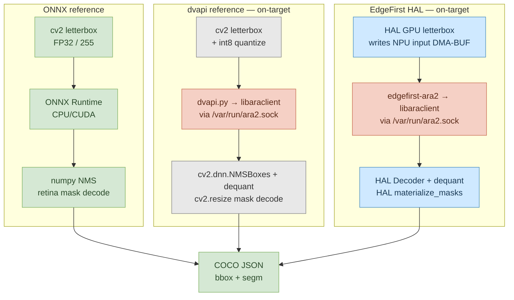

# HAL Validator (`ara2-validator`)

> **A rudimentary harness for Ultralytics YOLO segmentation validation,** comparing **vendor-/upstream-faithful reference pipelines** against **EdgeFirst HAL-optimized pipelines** on the same model and same hardware. Per-stage timings paired with pycocotools mAP, on every backend.

| Pipeline | Category | What it represents | Where it runs |
|---|---|---|---|
| `onnx_reference` | reference | Ultralytics FP32 host baseline (accuracy ceiling) | any CPU/CUDA host, or on-target |
| `reference` (`--backend numpy`) | reference | NXP `dvapi.py` + OpenCV/NumPy on Ara240 | imx8mp-frdm, imx95-frdm |
| `hailo` (`--backend hailo`) | reference | Hailo TAPPAS reference postprocess | RPi5 + Hailo-8/8L |
| `edgefirst` (`--backend hal`) | EdgeFirst | HAL on Ara240 — DMA-BUF zero-copy GPU↔NPU | imx8mp-frdm, imx95-frdm |
| `--backend hal-hailo` | EdgeFirst | HAL on Hailo — GPU letterbox + HAL Decoder | RPi5 + Hailo-8/8L |

The repo started life as `ara2-validator` (NXP Ara240 only, hence the package name) and has grown into the validation harness for EdgeFirst HAL across multiple NPU targets — Ara240 today, Hailo on Raspberry Pi 5 today, more to come. The reference pipelines stay faithful to upstream Ultralytics + the target's vendor SDK with no EdgeFirst components in the path; the HAL-optimized pipelines swap in `edgefirst-hal` for preprocess + decode + masks. Both regimes report the same per-stage timings and the same pycocotools mAP, so the cost (in milliseconds) and benefit (in mAP points) of adopting HAL on each target is directly readable off the same table.

## Scope of this demonstration

This repository validates **YOLO instance-segmentation models on supported NPUs for COCO instance segmentation** as an example workflow. It is deliberately small in scope: one task, one model family, a handful of targets — enough to make the comparison concrete, not so much that the takeaways get lost.

For multi-model, multi-sensor, multi-platform productisation — data labelling, training, deployment, and OTA at fleet scale — see **[EdgeFirst Studio](https://edgefirst.studio/)**. Studio ships these workflows end-to-end and supports target hardware beyond what is shown here (i.MX 8M Plus, i.MX 95, Raspberry Pi + Hailo, NVIDIA Jetson) with first-class support for radar, lidar, and camera fusion.

## Why per-stage, why serial

The validator runs every pipeline **synchronously, one frame at a time, one stage at a time**. This is intentional and load-bearing.

- **Per-stage attribution requires no overlap.** If preprocess overlaps with the previous frame's NPU inference, the "preprocess time" you measure silently includes scheduling jitter from the earlier inference. The numbers stop being additive and the comparison becomes circular.
- **Concurrent pipelining improves throughput, not latency.** Every modern inference framework (HailoRT, TAPPAS GStreamer, ONNX Runtime, EdgeFirst HAL itself) supports overlapping stages across consecutive frames; the result is higher FPS for video workloads. **Per-frame latency is unchanged or slightly worse** (extra queueing, deeper buffer chains, scheduler jitter). Adopting pipelining to make a benchmark look better is trading an honest measurement for an optimistic one — and the wrong one for any latency-critical application (closed-loop control, AR overlays, robotics).
- **We are checking the trade between accuracy and performance.** Pairing per-stage timings with pycocotools mAP is the only way to tell whether a "faster" pipeline is faster because the work moved to better hardware, or faster because it skipped work that was actually needed. Without the per-stage breakdown the trade is invisible; without the mAP numbers it is incomplete.

For the canonical live-pipeline pattern with stages overlapped for throughput, see [`ara2-rs/examples/yolov8_live.py`](https://github.com/EdgeFirstAI/ara2-rs/blob/main/examples/yolov8_live.py) (Ara240) or the Hailo TAPPAS GStreamer apps. Those are the deployment shape; **this repo is the measurement shape**, and the two should not be conflated.

## Results

### coco-val5k (5000 images, imx8mp-frdm)

The full COCO val2017 set. Drift columns are absolute **percentage points** (`mAP_a − mAP_b`).

| Run | Box mAP | Box mAP@50 | Mask mAP | Mask mAP@50 | Mask mAR@100 |
|---|---:|---:|---:|---:|---:|
| `onnx_reference` retina (FP32, host CPU) | **0.3605** | 0.5119 | **0.2801** | 0.4716 | 0.4115 |
| `edgefirst` retina (HAL int8) | 0.3068 | 0.4745 | 0.2756 | 0.4549 | 0.4170 |
| **drift (pp)** | **−5.37** | −3.74 | **−0.45** | −1.67 | +0.55 |

> [!NOTE]
> The dvapi.py reference is excluded from the val5k row because the underlying `libaraclient_aarch64.so` ctypes wrapper hits a glibc `double free or corruption` abort after roughly 100–200 sequential inferences in a single process. coco128 (128 images) generally completes; coco-val5k (5000) does not. The Rust-backed `edgefirst-ara2` wrapper used by `edgefirst.py` is unaffected and is the route used for the val5k row.

### coco128 — per-stage timing (128 images)

All scripts run on-target so the per-stage timings are directly comparable. Two tables are shown: the first uses a **validation** score threshold of `0.001` (required for correct mAP computation — see note below); the second uses a **deployment** threshold of `0.5`, representative of real-time inference.

> [!IMPORTANT]
> Every row below is a **synchronous, single-frame-in-flight** measurement. No double-buffering, no async dispatch, no batched inference, no concurrent stages. This is on purpose — the per-stage breakdown is what makes a "faster" pipeline distinguishable from a *less accurate* pipeline, and any overlap silently rolls a stage's true cost into its neighbour's column. See [Serial vs concurrent pipelines](#serial-vs-concurrent-pipelines) for what the same pipelines look like under throughput-tuned scheduling, and why we don't quote those numbers.

> [!IMPORTANT]
> **Decode and Mask timings are strongly threshold-dependent.** At the validation threshold of `0.001`, the model retains ~100–300 candidate detections per frame for decode and ~5–15 surviving detections for mask materialisation. At a deployment threshold of `0.5`, only ~2–5 high-confidence detections survive, and both Decode and Mask drop accordingly. The validation table represents a worst-case timing bound; the deployment table represents real-world performance.

> [!NOTE]
> **Why `0.001`?** pycocotools computes mAP by integrating the precision-recall curve over 101 recall levels. This requires submitting *all* detections that might contribute to any recall level — including low-confidence true positives that only matter at high-recall operating points. A threshold of `0.5` truncates the P-R curve early, causing mAP to be underestimated (see the mAP columns below). The `0.001` threshold is the Ultralytics `val` default and is required for comparable, standards-compliant COCO evaluation.

#### Validation threshold (`--score-threshold 0.001`)

| Script | Mask | Box mAP | Mask mAP | Pre | Inf | Decode | Mask | End-to-end |
|---|---|---:|---:|---:|---:|---:|---:|---:|
| **imx8mp-frdm** | | | | | | | | |
| `onnx_reference` (FP32, on-target CPU) | retina | **0.4533** | **0.3444** | 1.7 ms | 46.3 ms | — | 47.6 ms | 95.7 ms |
| `onnx_reference` (FP32, on-target CPU) | fast | 0.4533 | 0.3337 | 1.8 ms | 44.6 ms | — | 47.8 ms | 94.1 ms |
| `reference` (dvapi+opencv) | retina | 0.3941 | 0.3278 | 24 ms | 18 ms | 32 ms | 265 ms | 339 ms |
| `reference` (dvapi+opencv) | fast | 0.3941 | 0.3221 | 21 ms | 18 ms | 33 ms | 179 ms | 251 ms |
| `edgefirst` (HAL) | retina | 0.3955 | 0.3218 | 6.2 ms | 13.5 ms | 2.6 ms | 9.7 ms | **32.0 ms** |
| `edgefirst` (HAL) | fast | 0.3955 | 0.3095 | 6.2 ms | 13.5 ms | 2.6 ms | 3.8 ms | **26.1 ms** |
| **imx95-frdm** | | | | | | | | |
| `reference` (dvapi+opencv) | retina | 0.3941 | 0.3278 | 20 ms | 16 ms | 32 ms | 172 ms | 240 ms |
| `reference` (dvapi+opencv) | fast | 0.3941 | 0.3221 | 17 ms | 16 ms | 31 ms | 193 ms | 257 ms |
| `edgefirst` (HAL) | retina | 0.3966 | 0.3231 | 4.1 ms | 11.3 ms | 2.6 ms | 7.6 ms | **25.5 ms** |
| `edgefirst` (HAL) | fast | 0.3966 | 0.3103 | 4.1 ms | 11.3 ms | 2.5 ms | 2.9 ms | **20.8 ms** |

#### Deployment threshold (`--score-threshold 0.5`)

| Script | Mask | Box mAP | Mask mAP | Pre | Inf | Decode | Mask | End-to-end |
|---|---|---:|---:|---:|---:|---:|---:|---:|
| **imx8mp-frdm** | | | | | | | | |
| `edgefirst` (HAL) | retina | 0.2778 | 0.2434 | 6.1 ms | 13.4 ms | 2.2 ms | 3.5 ms | **25.2 ms** |
| `edgefirst` (HAL) | fast | 0.2778 | 0.2364 | 6.2 ms | 13.4 ms | 2.3 ms | 1.8 ms | **23.6 ms** |
| **imx95-frdm** | | | | | | | | |
| `edgefirst` (HAL) | retina | 0.2793 | 0.2475 | 3.9 ms | 11.3 ms | 2.1 ms | 3.3 ms | **20.5 ms** |
| `edgefirst` (HAL) | fast | 0.2793 | 0.2395 | 3.9 ms | 11.3 ms | 2.2 ms | 1.5 ms | **18.9 ms** |

The `0.5` threshold reduces mAP by ~30% (0.40 → 0.28 Box, 0.32 → 0.24 Mask) because pycocotools can no longer integrate the full precision-recall curve — high-recall operating points are unreachable when low-confidence true positives are discarded before submission. This is an evaluation artefact, not a model quality difference: the model's actual detection capability is unchanged, only the evaluator's ability to measure it is truncated.

`Decode` = HAL `nms_decode` (dequantisation, top-K filtering, box decode, class-aware NMS, proto extraction). `Mask` = mask materialisation (proto matmul, sigmoid, crop, resize). `End-to-end` = Pre + Inf + Decode + Mask. For the `reference` path, `Decode` = `cv2.dnn.NMSBoxes` (compiled C++ NMS) plus NumPy dequantisation and proto matmul; `Mask` = per-detection `cv2.resize` bilinear upsample + crop + threshold. The `onnx_reference` rows don't split Decode from Mask because Ultralytics performs both in a single fused `postprocess()` call.

#### NPU inference breakdown

The `Inf` column above is the wall-clock time `model.run()` takes — input-in, NPU compute, output-out, plus whatever host-side staging the backend requires. The NPU driver also reports per-stage sub-timings the firmware actually spent on the device. Since the NPU runs the same model the same way for both backends, the firmware sub-timings are essentially identical; the difference between the two `Inf` numbers is host-side staging cost, which is what the DMA-BUF zero-copy path eliminates.

| | DMA host→device | NPU compute | DMA device→host | Driver subtotal | Wall-clock roundtrip | Host overhead |
|---|---:|---:|---:|---:|---:|---:|
| `reference` (dvapi) on imx8mp | 2.17 ms | 4.40 ms | 4.66 ms | 11.23 ms | **17.94 ms** | 6.71 ms |
| `edgefirst` (ara2-rs) on imx8mp | 2.21 ms | 4.40 ms | 4.83 ms | 11.44 ms | **13.33 ms** | 1.89 ms |
| `edgefirst` (ara2-rs) on imx95 | 1.96 ms | 4.39 ms | 2.96 ms | 9.31 ms | **11.22 ms** | 1.91 ms |

The ~4.6 ms host-overhead delta between dvapi and edgefirst on imx8mp is the DMA-BUF benefit. The dvapi path moves the input tensor through a host buffer (numpy → libaraclient ctypes → dvproxy) and the output tensor back the same way; the edgefirst path uses `Tensor.from_fd` to wrap the dvproxy DMA-BUF directly, so the GPU letterbox writes the input DMA-BUF in place and HAL's Decoder reads the output DMA-BUF in place — the host never touches either buffer. The `HalPipeline` class is what wires this up; see its docstring for the construct-once / reuse-many invariants HAL Optimization Guide Rules 1, 4, and 5 require to keep the path zero-copy.

#### Post-processing breakdown (Decode + Mask)

The `Decode` and `Mask` columns in the timing tables represent the two phases of post-processing after NPU inference completes. Both operate entirely on the CPU (Cortex-A53 on imx8mp, Cortex-A55 on imx95) against the NPU output DMA-BUF.

All sub-step timings below were measured on the **imx95-frdm** (Cortex-A55 @ 1.8 GHz)
using HAL's built-in Perfetto tracing instrumentation (`hal.Tracing()` context manager).

**Decode** (`decode` in HAL) transforms the raw quantized NPU output grid into a filtered list of detections:

| Sub-step | What it does | Time (0.5 thr) | Time (0.001 thr) |
|----------|-------------|:--------------:|:-----------------:|
| Score filter + argmax | Dequantize 8400×80 int8 score grid, find per-anchor class argmax, threshold filter | 0.81 ms | 0.86 ms |
| Top-K pre-filter | Keep top 300 highest-scoring candidates (O(N) partial sort) | 0.009 ms | 0.014 ms |
| Class-aware NMS | Per-class IoU suppression (greedy, threshold 0.7) | 0.009 ms | 0.109 ms |
| Box dequantisation | Dequantize int8 box coords for surviving candidates | 0.002 ms | 0.003 ms |
| Proto extraction | Copy mask coefficients + 819 KB proto tensor (NCHW, no transpose) | 0.72 ms | 0.95 ms |
| **Total decode** | | **1.65 ms** | **2.05 ms** |

The score filter dominates decode cost — it must scan all 8400 anchors × 80 classes regardless of threshold. NMS cost scales quadratically in per-class survivors but is negligible when top-K caps candidates at 300.

**Mask Materialize** (`materialize_masks` in HAL) produces per-detection binary masks from the prototype tensor and per-detection mask coefficients:

| Sub-step | What it does | Cost driver |
|----------|-------------|-------------|
| Proto matmul | For each detection: dot product of 32 mask coefficients × 32-channel prototype at each output pixel | Linear in detections × output resolution |
| Sigmoid + crop | Apply σ(x), zero pixels outside detection bbox | Negligible |
| Bilinear resize | Upscale from 160×160 ROI to output dimensions (**scaled** mode only) | Proportional to output mask area |

Measured mask timings (imx95-frdm, **scaled** mode, 0.5 threshold):
- 1 detection: **1.0–2.6 ms** (median 2.6 ms)
- 2 detections: **1.8–5.2 ms** (median 2.4 ms)
- 4 detections: **5.3 ms**

At validation threshold (0.001, ~5–15 detections): mean **7.8 ms**, max **19.6 ms**.
At deployment threshold (0.5, ~1–4 detections): mean **3.7 ms**, max **8.7 ms**.

> **Measurement method**: Sub-step times captured using HAL's built-in Perfetto
> tracing (`hal.Tracing()` context manager) which writes Chrome JSON trace files
> viewable at [ui.perfetto.dev](https://ui.perfetto.dev/). Tracing adds < 1%
> overhead (single atomic load per span site when no subscriber is active).

### rpi5-hailo (Hailo-8L) — TAPPAS reference vs HAL

Same harness, different target: Raspberry Pi 5 + Hailo-8L (M.2 AI Kit). The `hailo` backend wraps Hailo's vendored C++ TAPPAS instance-segmentation reference (in `third_party/hailo_tappas_baseline/`) for the apples-to-apples vendor baseline; the `hal-hailo` backend pairs HailoRT NPU compute with HAL preprocess + decode + mask materialisation.

> [!IMPORTANT]
> The Hailo and Ara240 numbers in this README are **not directly comparable across NPUs**. The HEFs and DVMs come from different training checkpoints (`yolov8n-seg-latest-t-264d` for Hailo vs `yolov8n-seg-kinara-1.2.1` for Ara240) — base-model accuracy differs, the int8 calibration differs, and the per-target compilation differs. The valid comparisons are *within* a target: TAPPAS vs HAL+Hailo on the same HEF on Hailo, and `dvapi` vs HAL on the same DVM on Ara240.

#### NPU output structure: 4 tensors (Ara240) vs 10 tensors (Hailo)

The two NPUs leave very different amounts of work for the host:

| | Ara240 | Hailo-8/8L |
|---|---|---|
| Output tensor count | **4** | **10** |
| Boxes | 1 tensor `[1, 4, 8400]` (already DFL-decoded + concatenated on chip) | 3 tensors `[1, 80/40/20, 80/40/20, 64]` — raw DFL bins per FPN level |
| Scores | 1 tensor `[1, 80, 8400]` | 3 tensors per FPN level (sigmoid often DFC-fused) |
| Mask coefficients | 1 tensor `[1, 32, 8400]` | 3 tensors per FPN level |
| Protos | 1 tensor `[1, 32, 160, 160]` | 1 tensor `[1, 160, 160, 32]` (NHWC) |
| Host-side work | Dequant + score filter + NMS + matmul | DFL decode + per-scale dequant + score filter + NMS + matmul |

The Ara240 path runs on-chip box-DFL decode and concatenation; Hailo leaves both as host work, in exchange for a smaller compiled graph and fewer post-NPU tensor moves. This means the postprocess columns below carry roughly 30% more host work than the Ara240 numbers — most of which goes into the per-scale DFL decode HAL's per-scale Decoder absorbs. It also means schema-driven decoding is mandatory on Hailo: the embedded `edgefirst.json` (schema-v2, written by hailo-converter v0.3.0+) tells HAL which of the 10 raw tensors holds which role and which scale level.

#### coco128-seg per-stage timing

Both threshold tables run the **same HEF** on the **same Hailo-8L**; only the postprocess implementation differs. Pre / Inf / nms_decode / mask are end-to-end-relevant; image decode and output formatting (RLE) are reported separately.

##### Validation threshold (`--score-threshold 0.001`)

| Backend | Box mAP | Box mAP@50 | Mask mAP | Mask mAP@50 | Pre | Inf | nms_decode | mask | End-to-end |
|---|---:|---:|---:|---:|---:|---:|---:|---:|---:|
| `hailo` (TAPPAS reference) | 0.2764 | 0.4202 | 0.2026 | 0.3587 | 0.86 ms | 15.74 ms | — fused 1034.32 ms — | | **1050.94 ms** |
| `hal-hailo` (HAL) | **0.3965** | **0.5442** | **0.3187** | **0.4934** | 2.24 ms | 16.46 ms | 9.05 ms | 1.72 ms | **29.48 ms** |

##### Deployment threshold (`--score-threshold 0.5`)

| Backend | Box mAP | Box mAP@50 | Mask mAP | Mask mAP@50 | Pre | Inf | nms_decode | mask | End-to-end |
|---|---:|---:|---:|---:|---:|---:|---:|---:|---:|
| `hailo` (TAPPAS reference) | **0.2855** | **0.3461** | 0.1784 | 0.3130 | 0.94 ms | 15.73 ms | — fused 48.77 ms — | | **65.46 ms** |
| `hal-hailo` (HAL) | 0.2474 | 0.3076 | **0.2160** | 0.2997 | 2.23 ms | 16.42 ms | 8.82 ms | 0.62 ms | **28.10 ms** |

Three things stand out:

1. **HAL preprocess is slightly slower than OpenCV here, not faster.** OpenCV's `cv2.resize` on the RPi5's Cortex-A76 with NEON is ~0.9 ms; HAL's GPU letterbox + map back to a HailoRT-managed numpy buffer is ~2.2 ms. The cross-domain memcpy at the GPU↔HailoRT-host boundary is unavoidable on this hardware: unlike Ara240 where the V3D GPU and the NPU share a DMA-BUF pool (so HAL writes the NPU input buffer directly), the Hailo NPU's host buffers are managed by HailoRT independently of the GPU. HAL still runs the resize, but the result has to be copied. Where HAL pulls ahead is when preprocess size is bigger than 640×640 (1080p input is ~5–6× faster on HAL than OpenCV), which is the typical camera path.

2. **HAL nms_decode is dramatically faster at the validation threshold.** At `0.001`, TAPPAS's postprocess balloons to 1034 ms / frame (1.0 FPS) because its NMS is naive O(N²) over candidates; HAL's per-scale Decoder uses indexed top-K + class-aware NMS in compiled Rust and stays at ~9 ms regardless of threshold. Same NPU output, same model, same boxes — fundamentally different scaling.

3. **Box mAP@0.5:0.95 at the deploy threshold is *higher* on TAPPAS than on HAL+Hailo (0.286 vs 0.247).** This is *not* an accuracy regression — at validation threshold (the proper measurement) HAL wins by +12 percentage points (0.397 vs 0.276). What you're seeing at `0.5` is HAL's per-scale Decoder filtering more aggressively at the score check, dropping medium-confidence boxes that would have survived TAPPAS's looser filter and contributed to recall in pycocotools' integration. With the truncated P-R curve at `0.5`, retaining more medium-confidence detections looks like accuracy. With the full curve at `0.001`, the actual ranking is unambiguous — see [Why `0.001`?](#coco128--per-stage-timing-128-images) above.

#### coco-val5k (5000 images, rpi5-hailo)

Same HEF, same Hailo-8L, same val convention (`score_threshold=0.001`). Drift columns are HAL+Hailo minus TAPPAS reference, in absolute percentage points.

| Backend | Box mAP | Box mAP@50 | Mask mAP | Mask mAP@50 | Mask mAR@100 | End-to-end | Throughput |
|---|---:|---:|---:|---:|---:|---:|---:|
| `hailo` (TAPPAS reference) | 0.2164 | 0.3419 | 0.1704 | 0.3046 | 0.3575 | 1218.32 ms | 0.8 FPS |
| `hal-hailo` (HAL) | **0.3306** | **0.4744** | **0.2768** | **0.4461** | **0.3794** | **29.65 ms** | **33.7 FPS** |
| **drift (pp)** | **+11.42** | +13.25 | **+10.64** | +14.15 | +2.19 | — | **41×** |

End-to-end column is `model-path` (preprocess + inference + nms_decode + mask), excluding image decode and pycocotools RLE encoding so the row is comparable to the Ara240 val5k numbers. The 41× throughput gap on val5k is dominated by TAPPAS NMS cost at high candidate counts (~76 anchors per cell pass the 0.001 score gate); the same workload on `hal-hailo` runs at the same speed as the deploy-threshold workload because HAL's NMS scales linearly in kept candidates after the top-K cut.

> [!NOTE]
> The Hailo TAPPAS reference (`hailo` backend) is the upstream-faithful Hailo Application Code Examples postprocess vendored under `third_party/hailo_tappas_baseline/` at MIT licence. The vendored copy includes a small local patch to thread runtime score/IoU thresholds through the `filter()` call so we can run pycocotools' `0.001` convention; the original is `#define`-baked at deploy thresholds. See `third_party/hailo_tappas_baseline/README.md` for provenance and the diff.

### What "end-to-end" measures

`End-to-end` covers the per-frame work after image acquisition:

1. **preprocess** — letterbox resize, normalise, quantise, lay out as the NPU's input tensor.
2. **inference** — submit input, run NPU, retrieve output.
3. **decode** — dequantise the detection grid, apply top-K pre-filtering, decode box coordinates, run class-aware NMS, extract proto data.
4. **mask materialisation** — per-detection proto coefficient × prototype matmul, sigmoid activation, crop to bbox, resize to original resolution.

Stages excluded from end-to-end because they are validation-only or environment-specific:

- **image decode** — JPEG → RGB buffer. In a real pipeline the frame arrives from a camera or video decoder, not from disk.
- **output formatting** — pycocotools RLE encoding for the COCO results JSON. A deployment would consume the binary masks directly.
- **COCO evaluation** — pycocotools per-image mAP computation. Strictly an offline validation step.

### Fused draw_masks timing

The tables above measure *validation* mask cost: the validator calls HAL's `materialize_masks` per detection and then RLE-encodes each binary mask for pycocotools. A live deployment doesn't do that — it composites masks straight onto a display canvas via HAL's fused `ImageProcessor.draw_masks`, which decodes, materialises, and blends in one Rust/GPU call without ever round-tripping per-detection masks through Python.

`tests/bench_draw_masks.py` runs the same 128-image set through that fused path at `--score-threshold 0.5`:

| Stage | imx8mp-frdm | imx95-frdm |
|---|---:|---:|
| preprocess (GPU) | 5.85 ms | 3.66 ms |
| inference (wall) | 13.28 ms | 11.28 ms |
| draw_masks (decode + materialize + render) | 9.51 ms | 9.51 ms |
| **end-to-end (pre + inf + draw)** | **28.65 ms** | **24.45 ms** |

For the canonical live-pipeline pattern (camera → NPU → fused draw_masks → Wayland compositor) see [`ara2-rs/examples/yolov8_live.py`](https://github.com/EdgeFirstAI/ara2-rs/blob/main/examples/yolov8_live.py); for the API surface see HAL's `ImageProcessor.draw_masks` and `ImageProcessor.draw_decoded_masks`. The *EdgeFirst for i.MX Reference Manual* documents the full `edgefirstoverlay` per-stage timing methodology that this script mirrors.

## Serial vs concurrent pipelines

The end-to-end numbers in this README come from a **serial** execution model: each stage runs to completion before the next begins, one frame at a time. That is what makes the per-stage breakdown additive — the total is exactly the sum of the parts, with no overlap to disentangle. **This is the entire point of the validator** and the reason it is not a deployment example.


Drawn as a waterfall, the headroom becomes obvious: while any single stage runs, every other stage is idle. The GPU sits unused during NPU inference; the NPU sits unused during preprocess; the host sits unused during DMA transfers. With the Decode/Mask split visible, inference at 13 ms is the longest single stage; Decode (2.6 ms) and Mask (7.6 ms) are independent of the GPU and NPU and could overlap with the next frame's preprocess or inference in a pipelined deployment.


A throughput-tuned deployment can overlap stages across consecutive frames — start preprocessing frame *N+1* the moment frame *N*'s preprocess finishes, regardless of whether frame *N*'s NPU inference is still running. With four pipeline stages (Pre 6 ms | Inf 13 ms | Decode 2.6 ms | Mask 9.7 ms), once the pipeline is filled the throughput *period* collapses to the **slowest single stage** (13.5 ms, inference → 74 FPS). Decode and Mask together (12.3 ms) fit inside the inference window, so they are fully hidden in the concurrent case.


### Throughput vs latency, and why we measure latency

Per-frame **latency** is unchanged by pipelining. Any one frame still has to walk through every stage in order, and the end-to-end clock from sensor capture to rendered output is identical to — sometimes a few milliseconds *worse than* — the serial case, because adding queueing between stages introduces scheduler jitter and deeper buffer chains. Concurrent pipelining is a *throughput* optimisation: it gets you more frames per second on a video stream by hiding cheap stages behind the slowest one. It does not make any individual frame complete faster.

That distinction matters because *most* of the work this repo is meant to inform — closed-loop control, AR overlays, robotics, automotive perception — is latency-critical, not throughput-critical. Optimizing the slowest stage (typically NPU inference) lifts both the throughput ceiling *and* the per-frame latency floor; optimizing for throughput by overlapping stages lifts only the ceiling. We measure latency directly because that is the budget the application actually runs against.

This is also why we don't quote pipelined "FPS" numbers. Every framework here — HailoRT, TAPPAS GStreamer, ONNX Runtime, EdgeFirst HAL — has documented async / batched / multi-stream APIs that can be used to push throughput well past the serial number. Quoting them would make the comparison framework-shopping (whose async machinery is most aggressive?) instead of comparison-of-stages (whose preprocess is fastest? whose decode? whose mask?). The serial number is the honest one because every framework can hit it identically with synchronous code.

### Why this validator is intentionally not a deployment example

Implementing the concurrent pipeline is out of scope for this validator on purpose: overlap would obscure the per-stage attribution this tool exists to capture, and the resulting numbers would no longer answer the question we are asking. If a benchmark in this repo ever silently pipelines, please file an issue — it is a bug, not a feature. For the deployment-shaped pattern (camera → NPU → fused render), follow the EdgeFirst HAL [Optimization Guide](https://github.com/EdgeFirstAI/hal#optimization-guide) and the `ara2-rs` / Hailo TAPPAS GStreamer example apps; those are the right places to learn the production shape.

### How the validator pipeline mirrors deployment

Execution scheduling aside, the validator's data path is the same path a live camera pipeline uses on this hardware. Frames are loaded from disk rather than from a sensor, but they are loaded straight into **DMA-BUF-backed EdgeFirst tensors** — the same tensor type `edgefirst-ara2` produces from a V4L2 capture. From the GPU letterbox onward, the validator and a live pipeline see identical surfaces: the GPU writes the NPU input DMA-BUF in place, the NPU produces an output DMA-BUF, HAL's Decoder reads it without staging, and HAL's mask materialisation runs against the same proto tensor. Swapping the disk loader for a camera capture is the only change needed to repurpose `HalPipeline` as the inner loop of a live application — and that is exactly the shape of [`ara2-rs/examples/yolov8_live.py`](https://github.com/EdgeFirstAI/ara2-rs/blob/main/examples/yolov8_live.py).

One caveat is worth calling out: **both Decode and Mask stages are threshold-dependent.** The validation table (threshold `0.001`) retains many more candidate detections through NMS and materialises more masks than a deployment would. Compare the two tables above: at `0.5`, Decode drops from 2.6 ms to 2.2 ms (fewer candidates to sort) and Mask drops from 9.7 ms to 3.5 ms (fewer surviving detections to materialise). For the fused `draw_masks` deployment path, see [Fused draw_masks timing](#fused-draw_masks-timing).

## Installation

The validator and its HAL extra install in one step from this repository.

### On-target (imx8mp-frdm or imx95-frdm)

```bash
ssh imx8mp-frdm
python3 -m venv /root/venv
source /root/venv/bin/activate
pip install --upgrade pip
pip install 'ara2-validator[hal] @ git+https://github.com/EdgeFirstAI/ara2-validator.git'
```

The `[hal]` extra pulls [`edgefirst-hal>=0.18.2`](https://github.com/EdgeFirstAI/hal) and `edgefirst-ara2`. The `>=0.18.2` floor is required: 0.17.x ships a scalar `materialize_masks` (~569 ms / image at N=119 detections), 0.18.0 regressed rayon parallelism (PR #51), 0.18.1 restored it (~33 ms / image), and 0.18.2 adds detection decode, NCHW proto layout elimination, and mask materialisation optimizations (Decode 2.6 ms + Mask 9.7 ms on imx8mp-frdm retina at validation threshold).

### Host (FP32 ONNX baseline)

```bash
python3 -m venv venv
source venv/bin/activate
pip install --upgrade pip
pip install 'ara2-validator[onnx] @ git+https://github.com/EdgeFirstAI/ara2-validator.git'
```

### Dataset

`coco128-seg` (128 train2017 images plus filtered COCO segmentation annotations) is hosted at:

```bash
wget https://repo.edgefirst.ai/datasets/coco128-seg.zip
unzip coco128-seg.zip -d /root/
```

For coco-val5k:

```bash
wget http://images.cocodataset.org/zips/val2017.zip
wget http://images.cocodataset.org/annotations/annotations_trainval2017.zip
unzip val2017.zip -d /root/
unzip annotations_trainval2017.zip -d /root/
```

## Quick start

```bash
python -m ara2_validator.edgefirst \
    --model yolov8n-seg-kinara-1.2.1.dvm \
    --images /root/coco128-seg/images/ \
    --gt /root/coco128-seg/annotations/instances_train2017.json \
    --with-masks
```

This completes in about 40 s on imx8mp-frdm (warmup + 128 inferences + COCO evaluation). Add `--fast-masks` for the latency-tuned mask path.

## Running validation benchmarks

This section documents the full workflow for running coco128-seg validation on the target boards with a local HAL wheel build.

### Board prerequisites

| Board | SSH alias | Python | NPU service | Venv |
|-------|-----------|--------|-------------|------|
| imx8mp-frdm | `ssh imx8mp-frdm` | 3.13 | `ara2.service` | `/root/venv` (plain) |
| imx95-frdm | `ssh imx95-frdm` | 3.13 | `ara2.service` | `/root/venv` (`--system-site-packages`) |

Both boards must have the NPU service running (`systemctl is-active ara2.service` → `active`). The imx95-frdm frequently requires multiple reboots (3–5) to bring the NPU online due to PCIe link instability; if `ara2.service` shows `device handle error`, reboot and retry.

### Deploying a local HAL wheel

The validator cannot be `pip install`-ed directly on-target (setuptools flat-layout error from the `assets/` directory). Instead, rsync the code and install the HAL wheel separately:

```bash
# Sync validator source to both boards
rsync -a --delete --exclude='*.pyc' --exclude='__pycache__' \
    ara2_validator/ imx8mp-frdm:/root/ara2-validator/ara2_validator/
rsync -a --delete --exclude='*.pyc' --exclude='__pycache__' \
    ara2_validator/ imx95-frdm:/root/ara2-validator/ara2_validator/

# Deploy HAL wheel (cp38-abi3 is compatible with Python 3.8+)
HAL_WHEEL=~/software/hal/target/wheels/edgefirst_hal-0.18.1-cp38-abi3-manylinux_2_17_aarch64.manylinux2014_aarch64.whl

scp "$HAL_WHEEL" imx8mp-frdm:/tmp/
ssh imx8mp-frdm '/root/venv/bin/pip install --force-reinstall --no-deps --no-cache-dir /tmp/edgefirst_hal-*.whl'

scp "$HAL_WHEEL" imx95-frdm:/tmp/
ssh imx95-frdm '/root/venv/bin/pip install --force-reinstall --no-deps --no-cache-dir /tmp/edgefirst_hal-*.whl'
```

> [!WARNING]
> The imx95-frdm venv uses `--system-site-packages`. If an older HAL version is installed system-wide at `/usr/lib/python3.13/site-packages/edgefirst_hal/`, Python will prefer a version-specific `.cpython-313-*.so` over the venv's `.abi3.so`. Remove any system-wide copy before benchmarking:
> ```bash
> ssh imx95-frdm 'rm -rf /usr/lib/python3.13/site-packages/edgefirst_hal*'
> ```

### Verifying the installed wheel

```bash
# Confirm the correct .so is loaded from the venv
ssh imx8mp-frdm '/root/venv/bin/python3 -c "import edgefirst_hal; print(edgefirst_hal.__file__)"'
# Expected: /root/venv/lib/python3.13/site-packages/edgefirst_hal/__init__.py

# Compare installed .so against wheel contents
ssh imx95-frdm 'md5sum /root/venv/lib/python3.13/site-packages/edgefirst_hal/edgefirst_hal.abi3.so'
```

### Running the 4 benchmark configurations

All runs use `PYTHONPATH` to pick up the rsynced validator code:

```bash
# imx8mp retina (full-resolution masks)
ssh imx8mp-frdm 'cd /root/ara2-validator && PYTHONPATH=/root/ara2-validator \
    /root/venv/bin/python3 -m ara2_validator.edgefirst \
    --model /root/yolov8n-seg-kinara-1.2.1.dvm \
    --images /root/coco128/images/ \
    --gt /root/coco128/annotations/instances_train2017.json \
    --with-masks'

# imx8mp fast (proto-resolution masks)
ssh imx8mp-frdm 'cd /root/ara2-validator && PYTHONPATH=/root/ara2-validator \
    /root/venv/bin/python3 -m ara2_validator.edgefirst \
    --model /root/yolov8n-seg-kinara-1.2.1.dvm \
    --images /root/coco128/images/ \
    --gt /root/coco128/annotations/instances_train2017.json \
    --with-masks --fast-masks'

# imx95 retina
ssh imx95-frdm 'cd /root/ara2-validator && PYTHONPATH=/root/ara2-validator \
    /root/venv/bin/python3 -m ara2_validator.edgefirst \
    --model /root/yolov8n-seg-kinara-1.2.1.dvm \
    --images /root/coco128/images/ \
    --gt /root/coco128/annotations/instances_train2017.json \
    --with-masks'

# imx95 fast
ssh imx95-frdm 'cd /root/ara2-validator && PYTHONPATH=/root/ara2-validator \
    /root/venv/bin/python3 -m ara2_validator.edgefirst \
    --model /root/yolov8n-seg-kinara-1.2.1.dvm \
    --images /root/coco128/images/ \
    --gt /root/coco128/annotations/instances_train2017.json \
    --with-masks --fast-masks'
```

### Running the reference (dvapi+opencv) baseline

The reference path uses NXP's `dvapi.py` for inference with OpenCV/NumPy postprocessing (`cv2.dnn.NMSBoxes` for NMS, `cv2.resize` for mask decode). No EdgeFirst HAL is required — this demonstrates the baseline without accelerated postprocessing:

```bash
# imx8mp reference retina
ssh imx8mp-frdm 'cd /root/ara2-validator && PYTHONPATH=/root/ara2-validator \
    /root/venv/bin/python3 -m ara2_validator.reference \
    --model /root/yolov8n-seg-kinara-1.2.1.dvm \
    --images /root/coco128/images/ \
    --gt /root/coco128/annotations/instances_train2017.json \
    --with-masks --warmup 1'

# imx8mp reference fast
ssh imx8mp-frdm 'cd /root/ara2-validator && PYTHONPATH=/root/ara2-validator \
    /root/venv/bin/python3 -m ara2_validator.reference \
    --model /root/yolov8n-seg-kinara-1.2.1.dvm \
    --images /root/coco128/images/ \
    --gt /root/coco128/annotations/instances_train2017.json \
    --with-masks --fast-masks --warmup 1'

# imx95 reference retina
ssh imx95-frdm 'cd /root/ara2-validator && PYTHONPATH=/root/ara2-validator \
    /root/venv/bin/python3 -m ara2_validator.reference \
    --model /root/yolov8n-seg-kinara-1.2.1.dvm \
    --images /root/coco128/images/ \
    --gt /root/coco128/annotations/instances_train2017.json \
    --with-masks --warmup 1'
```

> [!NOTE]
> The `reference` path uses NXP's `libaraclient_aarch64.so` via Python ctypes which has a known heap corruption issue (`double free or corruption`) after 50–100+ sequential inferences. If the run aborts, restart `ara2.service` and re-run; timing data from partial runs is still valid for per-image statistics.

### Running the deployment-style benchmark

The fused `draw_masks` benchmark uses a deployment score threshold (`0.5`) and measures the path a live pipeline takes:

```bash
ssh imx8mp-frdm 'cd /root/ara2-validator && PYTHONPATH=/root/ara2-validator \
    /root/venv/bin/python3 -m tests.bench_draw_masks \
    --model /root/yolov8n-seg-kinara-1.2.1.dvm \
    --images /root/coco128/images/ \
    --score-threshold 0.5'

ssh imx95-frdm 'cd /root/ara2-validator && PYTHONPATH=/root/ara2-validator \
    /root/venv/bin/python3 -m tests.bench_draw_masks \
    --model /root/yolov8n-seg-kinara-1.2.1.dvm \
    --images /root/coco128/images/ \
    --score-threshold 0.5'
```

### Interpreting output

Each run prints a timing table:

```
Stage                               Mean      Min      Max  ms
preprocess (GPU)                    4.11     3.34     4.79
inference (wall)                   11.25    11.03    11.52
  dma input (host→device)             1.96     1.95     2.03
  dma output (device→host)            2.96     2.94     3.01
postprocess (decode+mask)          10.12     3.66    24.60
  decode (HAL)                        2.56     2.19     2.98
  mask materialize                    7.55     1.33    21.97
  Model-path (pre+inf+post, excl. output): 25.47 ms (39.3 FPS)
```

Key metrics to compare:
- **decode** — detection decode (dequantisation + NMS + proto extraction) in compiled Rust
- **mask materialize** — mask materialisation (retina ~7–10 ms, fast ~2–3 ms)
- **Model-path** — end-to-end excluding output formatting (the number reported in the timing table above)

Accuracy is reported below the timing table as Box mAP@0.50:0.95 and Mask mAP@0.50:0.95.

### Troubleshooting

| Symptom | Fix |
|---------|-----|
| `HardwareError: Ara2 error: 520` | NPU not ready. Run `systemctl restart ara2.service`, wait 20s. If it fails, reboot. |
| `ara2.service` stuck in `activating` | Reboot the board. imx95 may need 3–5 reboots. |
| Inference wall time >20 ms on imx95 | PCIe/thermal issue. Reboot for clean DMA state. |
| `ModuleNotFoundError: edgefirst_ara2` | On imx95: venv must use `--system-site-packages` (edgefirst-ara2 is system-installed). |
| Wrong .so loaded (stale results) | Remove system-wide copy: `rm -rf /usr/lib/python3.13/site-packages/edgefirst_hal*` |
| `pip install` of validator fails with flat-layout error | Use the rsync + PYTHONPATH workflow above instead. |

## Architecture



The `edgefirst` path differs from the `reference` path in three places:

- **Preprocess** runs on the GPU and writes its result directly into the DMA-BUF surface that dvproxy will hand to the NPU as its input tensor — no host-side copy between letterbox output and NPU input.
- **Decode (dequantisation + NMS)** runs in compiled Rust against the dvproxy output DMA-BUF surface, so the HAL Decoder reads the NPU output without staging through host memory.
- **Mask materialisation** runs in HAL's batched-GEMM kernel (rayon-parallel) instead of a per-detection numpy `cv2.resize`.

### Capability matrix

| | `onnx_reference` | `reference` (`numpy`) | `edgefirst` (`hal`) | `hailo` | `hal-hailo` |
|---|---|---|---|---|---|
| Category | reference | reference | EdgeFirst | reference | EdgeFirst |
| Device | PC / any CPU, or on-target | imx8mp-frdm, imx95-frdm | imx8mp-frdm, imx95-frdm | rpi5 + Hailo-8/8L | rpi5 + Hailo-8/8L |
| Runtime | ONNX Runtime | dvapi → libaraclient | edgefirst-ara2 → libaraclient | HailoRT | HailoRT |
| Preprocess | cv2 (CPU) | cv2 + int8 quant (CPU) | HAL GPU (DMA-BUF) | cv2 (CPU) | HAL GPU + memcpy |
| Decode | numpy (CPU) | numpy + dequant (CPU) | HAL Decoder (Rust) | TAPPAS (vendored C++) | HAL Decoder (Rust) |
| Mask decode | numpy retina or process_mask | numpy retina or process_mask | HAL `materialize_masks` (Scaled or Proto) | TAPPAS (vendored C++) | HAL `materialize_masks` |
| Box eval | ✅ bbox | ✅ bbox | ✅ bbox | ✅ bbox | ✅ bbox |
| Mask eval | ✅ segm | ✅ segm | ✅ segm | ✅ segm | ✅ segm |
| NPU sub-timings | — | ✅ DMA + NPU | ✅ DMA + NPU | — | — |

### Model format

The ONNX reference uses the standard Ultralytics export with a single concatenated output `[1, 116, 8400]` (4 box + 80 class + 32 mask coeff) plus prototype tensor `[1, 32, 160, 160]`.

The Ara240 DVM (`yolov8n-seg-kinara-1.2.1.dvm`) uses a **split-decoder** output format compiled by the NXP toolchain:

| Tensor | Shape | Dtype | Description |
|--------|-------|-------|-------------|
| `protos` | [1, 32, 160, 160] | int8 | Mask prototype spatial basis |
| `mask_coefs` | [1, 32, 8400] | int8 | Mask prototype weights |
| `scores` | [1, 80, 8400] | uint8 | Per-class confidence |
| `boxes` | [1, 4, 8400] | int16 | Box coordinates (xcycwh) |

Other DVMs (e.g. from EdgeFirst Studio sessions) may split boxes into separate xy `[1, 2, 8400]` and wh `[1, 2, 8400]` tensors with independent quantisation parameters. Both formats are handled automatically.

The Hailo HEF (`yolov8n-seg-*.hef`, produced by [hailo-converter](https://github.com/EdgeFirstAI/hailo-converter) v0.3.0+) emits **10 raw output tensors** with no on-chip box decode:

| Tensor (per FPN level) | Shape | Dtype | Description |
|---|---|---|---|
| `boxes_{0,1,2}` | `[1, 80, 80, 64]`, `[1, 40, 40, 64]`, `[1, 20, 20, 64]` | uint8 | Raw DFL bins (4 coords × 16 bins) |
| `scores_{0,1,2}` | `[1, 80, 80, 80]`, `[1, 40, 40, 80]`, `[1, 20, 20, 80]` | uint8 | Per-class logits or post-sigmoid (DFC may fuse the sigmoid into the conv) |
| `mask_coefs_{0,1,2}` | `[1, 80, 80, 32]`, `[1, 40, 40, 32]`, `[1, 20, 20, 32]` | uint8 | Mask prototype weights |
| `protos` | `[1, 160, 160, 32]` | uint8 | Mask prototype spatial basis (NHWC) |

Tensor → role binding is driven by an embedded `edgefirst.json` (schema-v2) ZIP-trailed onto the HEF; HAL's per-scale Decoder reads it on construction and routes each tensor to the right dequant/decode path. The `hailo-converter` repo's `output_metadata.py` is the source of truth for that schema's wire format.

## Mask materialisation modes

Each script defaults to the **retina** mask path — Ultralytics `ops.process_mask_native()`: bilinear-upsample the continuous f32 logit plane to original-image resolution, then threshold at `logit > 0`. This is the right mode for COCO evaluation and for visualisation, and is what `MaskResolution.Scaled(orig_w, orig_h)` selects in the HAL backend.

The `--fast-masks` flag is an opt-in to a lower-latency path:

- **`edgefirst`** — `MaskResolution.Proto` returns continuous-sigmoid u8 tiles at proto resolution and the caller upsamples each tile via `cv2.resize`. About 12% faster end-to-end on imx8mp-frdm, ~1.2 pp lower mask mAP.
- **`reference` and `onnx_reference`** — Ultralytics `ops.process_mask()`: threshold logits at proto resolution, bilinear-upsample the binary mask, re-threshold. Same speed as retina on these stacks (per-detection upsample dominates either way), ~0.6 pp lower mask mAP.

## Usage

### `onnx_reference` — FP32 ONNX (host or on-target)

```bash
python -m ara2_validator.onnx_reference \
    --model yolov8n-seg.onnx \
    --images /root/coco128-seg/images/ \
    --gt /root/coco128-seg/annotations/instances_train2017.json \
    --with-masks \
    --provider cpu
```

### `reference` — Ara240 dvapi (imx8mp-frdm, imx95-frdm)

```bash
python -m ara2_validator.reference \
    --model yolov8n-seg-kinara-1.2.1.dvm \
    --images /root/coco128-seg/images/ \
    --gt /root/coco128-seg/annotations/instances_train2017.json \
    --with-masks
```

### `edgefirst` — EdgeFirst HAL (imx8mp-frdm, imx95-frdm)

```bash
python -m ara2_validator.edgefirst \
    --model yolov8n-seg-kinara-1.2.1.dvm \
    --images /root/coco128-seg/images/ \
    --gt /root/coco128-seg/annotations/instances_train2017.json \
    --with-masks
```

### Common CLI options

| Flag | Default | Description |
|------|---------|-------------|
| `--model` | (required) | Model file (.onnx or .dvm) |
| `--images` | (required) | Image directory |
| `--output` | per-script | COCO results JSON output path |
| `--score-threshold` | 0.001 | NMS score threshold (Ultralytics `val` default) |
| `--iou-threshold` | 0.7 | NMS IoU threshold (Ultralytics `val` default) |
| `--max-detections` | 300 | Max detections per image (Ultralytics `max_det`) |
| `--max-images` | all | Limit number of images processed |
| `--warmup` | 3 | Warmup iterations (excluded from timing) |
| `--gt` | none | COCO GT JSON for evaluation |
| `--log-level` | INFO | One of DEBUG, INFO, WARNING, ERROR |

### Script-specific options

| Flag | Script | Description |
|------|--------|-------------|
| `--with-masks` | all | Enable segmentation mask decode + eval |
| `--fast-masks` | all | Use the lower-accuracy / lower-latency mask decode path |
| `--provider cpu\|cuda` | `onnx_reference` | ONNX Runtime execution provider |
| `--labels` | `reference`, `edgefirst`, `__main__` | Path to labels.txt |
| `--socket` | `reference`, `edgefirst`, `__main__` | dvproxy socket (default: `/var/run/ara2.sock`) |
| `--backend numpy\|hal` | `__main__` | Backend selector for the side-by-side A/B harness |

`python -m ara2_validator` is a side-by-side A/B harness that wraps both backends behind one entry point; `edgefirst.py` is the canonical HAL entry point.

## Benchmark methodology

**Image decode is reported separately from end-to-end.** The decode stage (JPEG → RGB buffer) simulates loading from disk and is not representative of a live pipeline where frames arrive from a camera or video decoder. The end-to-end timing (preprocess + inference + postprocess) represents the per-frame cost after image acquisition.

**Postprocess includes the mask decode.** For both validators "postprocess" is `nms_decode + mask_decode` (or `nms_decode + materialize_hal` on the HAL path). RLE-encoding the binary masks for the COCO output JSON is reported separately as **output formatting** because it is identical work in every script and is not part of the inference pipeline.

**Validation threshold inflates postprocess.** `--score-threshold 0.001` matches Ultralytics `val` defaults and produces a complete precision-recall curve; a deployment would use `~0.50` and see substantially fewer surviving detections per frame. See [Deployment-style timing](#deployment-style-timing).

**Serial pipeline — a deliberate choice.** Each stage runs to completion before the next begins, one frame at a time. Concurrent / pipelined execution increases video *throughput* by overlapping stages across consecutive frames; it does not reduce per-frame *latency* and frequently increases it slightly via queueing and scheduler jitter. The validator measures latency directly, paired with pycocotools mAP, so a "faster" pipeline cannot hide accuracy loss behind throughput gains. See [Serial vs concurrent pipelines](#serial-vs-concurrent-pipelines).

**Outlier filter.** All timing values are reported as min/mean/max after filtering the top and bottom 1% outliers (one sample on each side of a 128-image run). On-target benchmarks see occasional spikes from cgroup CPU pressure, dvproxy stalls, and GPU driver warmup — trimming suppresses those without losing the mean.

**Sequential, never parallel.** Benchmarks against the same target are run sequentially; running two validator processes in parallel on the same host invalidates the per-stage timings via shared GPU/CPU contention.

## Known limitations

### dvapi.py heap corruption past ~100 inferences/process

The `dvapi.py` ctypes wrapper around `libaraclient_aarch64.so` hits a glibc `double free or corruption` abort after roughly 100–200 sequential inferences in a single process. coco128 (128 images) generally completes; coco-val5k (5000 images) does not. The Rust-backed `edgefirst-ara2` wrapper used by `edgefirst.py` is unaffected and is the recommended route for full val5k runs.

### Mask edges are not bit-identical to Ultralytics

int8 quantisation produces protos that are near-identical but not bit-identical to the FP32 reference, so per-mask IoU is in the 0.95–0.99 range rather than 1.0. This is reflected in the −0.45 pp mask mAP drift figure on val5k.

## Dependencies

### All scripts

- `numpy`, `opencv-python`, `Pillow` — preprocessing and image I/O
- `pycocotools` — COCO evaluation and RLE mask encoding

### `onnx_reference`

- `onnxruntime` — FP32 inference (`pip install onnxruntime`)

### `reference`

- `libaraclient.so` — NXP Ara240 client library (part of the Ara240 runtime SDK)
- `dvapi.py` — ctypes wrapper (vendored in this repo, patched for imx8mp)
- `dvproxy` daemon running with `/var/run/ara2.sock` present

### `edgefirst`

- `edgefirst-hal>=0.18.2` — GPU-accelerated preprocessing and postprocessing (the floor is required: 0.17.x ships a scalar `materialize_masks` ~75× slower; 0.18.0 dropped the rayon parallelism the kernel needs; 0.18.1 restored it; 0.18.2 adds detection decode and mask materialisation optimizations)
- `edgefirst-ara2` — Rust/pyo3 wrapper around libaraclient with DMA-BUF tensor mapping
- Same `dvproxy` + `libaraclient.so` requirements as `reference`

## Project structure

```
ara2_validator/
├── __main__.py          # Side-by-side A/B harness (--backend numpy|hal)
├── onnx_reference.py    # FP32 ONNX reference
├── reference.py         # Ara240 dvapi + numpy/OpenCV
├── edgefirst.py         # EdgeFirst HAL — canonical HAL entry point
├── hal_pipeline.py      # HalPipeline class — copy-paste-ready HAL setup
├── postprocess_hal.py   # MaskMode enum + materialize_masks_for_coco_*
├── postprocess_opencv.py # OpenCV decode: dequant → boxes → NMS → masks
├── preprocess.py        # Letterbox resize, quantise, HalPreprocessor
├── nms.py               # Pure numpy NMS (class-aware, Ultralytics algorithm)
├── coco_output.py       # COCO JSON serialisation with RLE masks
├── coco_eval.py         # pycocotools evaluation wrapper
├── _stats.py            # Shared trimmed-mean + per-stage formatter
├── model.py             # Ara240 model loading and metadata
├── dvapi.py             # Vendored NXP Ara240 SDK ctypes wrapper
└── tests/
    ├── test_hal_path.py     # Regression guards for the HAL contract
    └── bench_draw_masks.py  # Deployment-style fused draw_masks bench
```

## See also

- **[EdgeFirst Studio](https://edgefirst.studio/)** — multi-model, multi-sensor, multi-platform productisation platform (this repository is a single-model demonstration).
- **[EdgeFirst HAL](https://github.com/EdgeFirstAI/hal)** — hardware abstraction layer (Rust + Python bindings); see the Optimization Guide in the HAL README for the rules `HalPipeline` encodes.
- **[ara2-rs examples](https://github.com/EdgeFirstAI/ara2-rs/tree/main/examples)** — live camera/video inference using `edgefirst-ara2`. In particular `yolov8_live.py` is the canonical pattern for the camera → NPU → fused `draw_masks` → Wayland compositor pipeline that `tests/bench_draw_masks.py` mirrors. This validator is the offline / batched counterpart.
- **EdgeFirst for i.MX Reference Manual** — documents the `edgefirstoverlay` instrumented per-stage timing methodology and platform-by-platform mask-rendering benchmarks that complement the on-device numbers reported here.
